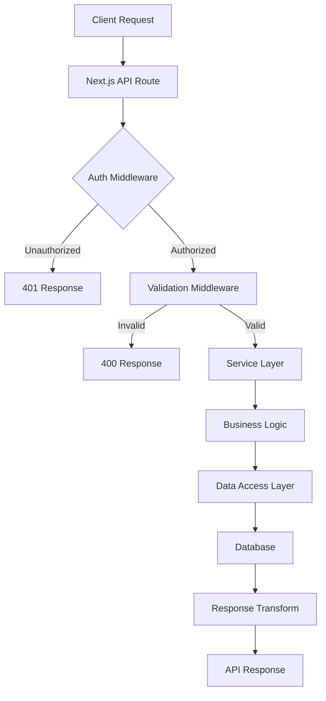

# Backend Architecture

## Overview

The Dental Dashboard backend is built on Next.js API Routes with Supabase Edge Functions for complex operations. This document describes the service layer organization, patterns, and best practices for backend development.

## Quick Reference

```typescript
// API Route Pattern
app/api/providers/route.ts         // Collection endpoints
app/api/providers/[id]/route.ts    // Resource endpoints

// Service Layer Pattern
lib/services/providers/provider-service.ts   // Business logic
lib/database/queries/providers.ts            // Data access
lib/api/middleware.ts                        // Auth & validation
```

## Architecture Layers

### 1. API Routes Layer (`app/api/`)

The entry point for all backend requests. Responsibilities:
- HTTP request/response handling
- Route parameter extraction
- Delegation to service layer
- Response formatting

```typescript
// app/api/providers/route.ts
import { withAuth } from '@/lib/auth/middleware'
import { ProviderService } from '@/lib/services/providers'
import { apiSuccess, apiError, getPaginationParams } from '@/lib/api/utils'

export const GET = withAuth(async (request, { user }) => {
  try {
    const { page, limit, sortBy, sortOrder } = getPaginationParams(request)
    
    const result = await ProviderService.getProvidersByClinic({
      clinicId: user.clinicId,
      page,
      limit,
      sortBy,
      sortOrder
    })
    
    return apiPaginated(result.data, result.meta)
  } catch (error) {
    return handleApiError(error)
  }
})

export const POST = withAuth(async (request, { user }) => {
  try {
    const body = await request.json()
    
    const provider = await ProviderService.createProvider({
      ...body,
      clinicId: user.clinicId
    })
    
    return apiSuccess(provider, 201)
  } catch (error) {
    return handleApiError(error)
  }
})
```

### 2. Service Layer (`lib/services/`)

Business logic and orchestration. Responsibilities:
- Business rule enforcement
- Transaction coordination
- Complex calculations
- External service integration

```typescript
// lib/services/providers/provider-service.ts
import { BaseService } from '@/lib/services/base/base-service'
import { providerQueries } from '@/lib/database/queries/providers'
import { ProviderValidator } from './provider-validator'
import { MetricsService } from '../metrics'

export class ProviderService extends BaseService {
  static async createProvider(data: CreateProviderDto) {
    // Validate input
    const validated = await ProviderValidator.validateCreate(data)
    
    // Business rules
    if (await this.isDuplicateLicense(validated.licenseNumber)) {
      throw new BusinessError('License number already exists')
    }
    
    // Create provider
    const provider = await providerQueries.create(validated)
    
    // Initialize metrics
    await MetricsService.initializeProviderMetrics(provider.id)
    
    // Send notifications
    await this.notifyClinicOfNewProvider(provider)
    
    return provider
  }

  static async getProviderPerformance(providerId: string, dateRange: DateRange) {
    // Fetch raw data
    const [provider, metrics, goals] = await Promise.all([
      providerQueries.findById(providerId),
      MetricsService.getProviderMetrics(providerId, dateRange),
      GoalService.getProviderGoals(providerId, dateRange)
    ])
    
    // Calculate performance
    return {
      provider,
      metrics,
      goals,
      performance: this.calculatePerformance(metrics, goals)
    }
  }
  
  private static calculatePerformance(metrics: Metrics, goals: Goals) {
    // Complex business logic here
  }
}
```

### 3. Data Access Layer (`lib/database/`)

Database operations using Prisma. Responsibilities:
- Database queries
- Data transformations
- Query optimization
- Transaction management

```typescript
// lib/database/queries/providers.ts
import { prisma } from '@/lib/database/client'
import { Prisma } from '@prisma/client'

export const providerQueries = {
  async findById(id: string) {
    return prisma.provider.findUnique({
      where: { id },
      include: {
        locations: true,
        user: {
          select: { email: true, isActive: true }
        }
      }
    })
  },

  async findByClinic(clinicId: string, options: PaginationOptions) {
    const { page = 1, limit = 20, sortBy = 'name', sortOrder = 'asc' } = options
    
    const where: Prisma.ProviderWhereInput = {
      clinicId,
      isActive: true
    }
    
    // Parallel queries for performance
    const [data, totalCount] = await Promise.all([
      prisma.provider.findMany({
        where,
        orderBy: { [sortBy]: sortOrder },
        skip: (page - 1) * limit,
        take: limit,
        include: {
          locations: true,
          _count: {
            select: { appointments: true }
          }
        }
      }),
      prisma.provider.count({ where })
    ])
    
    return {
      data,
      meta: {
        page,
        limit,
        totalCount,
        totalPages: Math.ceil(totalCount / limit)
      }
    }
  },

  async create(data: Prisma.ProviderCreateInput) {
    return prisma.provider.create({
      data,
      include: { locations: true }
    })
  }
}
```

## Middleware Architecture

### Authentication Middleware

```typescript
// lib/auth/middleware.ts
import { createServerClient } from '@supabase/ssr'
import { apiError } from '@/lib/api/utils'

export function withAuth(
  handler: (req: Request, context: AuthContext) => Promise<Response>
) {
  return async (request: Request) => {
    try {
      const supabase = createServerClient()
      const { data: { user }, error } = await supabase.auth.getUser()
      
      if (error || !user) {
        return apiError('Unauthorized', 401)
      }
      
      // Get user's clinic context
      const dbUser = await prisma.user.findUnique({
        where: { id: user.id },
        include: { clinic: true }
      })
      
      if (!dbUser?.clinicId) {
        return apiError('No clinic association', 403)
      }
      
      // Pass authenticated context
      return handler(request, {
        user: {
          id: user.id,
          email: user.email!,
          clinicId: dbUser.clinicId,
          role: dbUser.role,
          permissions: getPermissions(dbUser.role)
        }
      })
    } catch (error) {
      logger.error('Auth middleware error:', error)
      return apiError('Authentication failed', 401)
    }
  }
}
```

### Validation Middleware

```typescript
// lib/api/validation.ts
import { z } from 'zod'

export function withValidation<T>(
  schema: z.ZodSchema<T>,
  handler: (req: Request, data: T) => Promise<Response>
) {
  return async (request: Request) => {
    try {
      const body = await request.json()
      const validated = schema.parse(body)
      
      return handler(request, validated)
    } catch (error) {
      if (error instanceof z.ZodError) {
        return apiError('Validation failed', 400, {
          errors: error.errors.map(e => ({
            field: e.path.join('.'),
            message: e.message
          }))
        })
      }
      throw error
    }
  }
}

// Usage
export const POST = withAuth(
  withValidation(CreateProviderSchema, async (req, data) => {
    // data is fully typed and validated
  })
)
```

## Request/Response Flow



## Service Communication Patterns

### Internal Service Calls

```typescript
// Services calling other services
class AppointmentService {
  static async bookAppointment(data: BookingData) {
    // Validate provider availability
    const provider = await ProviderService.getProvider(data.providerId)
    if (!provider.isActive) {
      throw new BusinessError('Provider not available')
    }
    
    // Check patient
    const patient = await PatientService.getOrCreate(data.patientData)
    
    // Create appointment
    const appointment = await appointmentQueries.create({
      providerId: data.providerId,
      patientId: patient.id,
      ...data
    })
    
    // Update metrics
    await MetricsService.incrementAppointmentCount(data.providerId)
    
    // Send notifications
    await NotificationService.sendAppointmentConfirmation(appointment)
    
    return appointment
  }
}
```

### External API Integration

```typescript
// lib/services/google/sheets-sync-service.ts
export class SheetsSyncService {
  private static sheets = google.sheets({ version: 'v4' })
  
  static async syncProviderData(clinicId: string) {
    try {
      // Get OAuth credentials
      const credentials = await this.getClinicCredentials(clinicId)
      
      // Fetch spreadsheet data
      const data = await this.sheets.spreadsheets.values.get({
        spreadsheetId: credentials.spreadsheetId,
        range: 'Providers!A:E',
        auth: this.getAuthClient(credentials)
      })
      
      // Transform data
      const providers = this.transformSheetData(data.values)
      
      // Sync with database
      for (const provider of providers) {
        await ProviderService.upsertProvider({
          ...provider,
          clinicId
        })
      }
      
      return { synced: providers.length }
    } catch (error) {
      logger.error('Sheet sync failed:', error)
      throw new ExternalServiceError('Google Sheets sync failed')
    }
  }
}
```

## Background Job Processing

### Supabase Edge Functions

```typescript
// supabase/functions/calculate-daily-metrics/index.ts
import { serve } from 'https://deno.land/std@0.177.0/http/server.ts'
import { createClient } from '@supabase/supabase-js'

serve(async (req: Request) => {
  try {
    const supabase = createClient(
      Deno.env.get('SUPABASE_URL')!,
      Deno.env.get('SUPABASE_SERVICE_ROLE_KEY')!
    )
    
    // Get all active clinics
    const { data: clinics } = await supabase
      .from('clinics')
      .select('id')
      .eq('is_active', true)
    
    // Calculate metrics for each clinic
    for (const clinic of clinics) {
      await calculateClinicMetrics(supabase, clinic.id)
    }
    
    return new Response(JSON.stringify({ success: true }), {
      headers: { 'Content-Type': 'application/json' }
    })
  } catch (error) {
    return new Response(JSON.stringify({ error: error.message }), {
      status: 500,
      headers: { 'Content-Type': 'application/json' }
    })
  }
})

async function calculateClinicMetrics(supabase: any, clinicId: string) {
  // Complex metric calculations
  const startOfDay = new Date()
  startOfDay.setHours(0, 0, 0, 0)
  
  // Aggregate production
  const { data: production } = await supabase
    .from('appointments')
    .select('production_amount')
    .eq('clinic_id', clinicId)
    .gte('appointment_date', startOfDay.toISOString())
    .lt('appointment_date', new Date().toISOString())
  
  const totalProduction = production.reduce(
    (sum, apt) => sum + apt.production_amount, 
    0
  )
  
  // Store calculated metric
  await supabase.from('daily_metrics').upsert({
    clinic_id: clinicId,
    date: startOfDay.toISOString(),
    total_production: totalProduction,
    updated_at: new Date().toISOString()
  })
}
```

### Scheduled Jobs

```typescript
// Supabase cron configuration
-- Run daily at 2 AM
SELECT cron.schedule(
  'calculate-daily-metrics',
  '0 2 * * *',
  $$
  SELECT net.http_post(
    url := 'https://yovbdmjwrrgardkgrenc.supabase.co/functions/v1/calculate-daily-metrics',
    headers := jsonb_build_object(
      'Authorization', 'Bearer ' || current_setting('app.settings.service_role_key')
    )
  ) AS request_id;
  $$
);
```

## Error Handling Patterns

### Custom Error Classes

```typescript
// lib/api/errors.ts
export class ApiError extends Error {
  constructor(
    message: string,
    public statusCode: number,
    public details?: any
  ) {
    super(message)
    this.name = 'ApiError'
  }
}

export class BusinessError extends ApiError {
  constructor(message: string, details?: any) {
    super(message, 400, details)
    this.name = 'BusinessError'
  }
}

export class NotFoundError extends ApiError {
  constructor(resource: string) {
    super(`${resource} not found`, 404)
    this.name = 'NotFoundError'
  }
}

export class ValidationError extends ApiError {
  constructor(errors: any[]) {
    super('Validation failed', 400, { errors })
    this.name = 'ValidationError'
  }
}
```

### Error Handler

```typescript
// lib/api/error-handler.ts
export async function handleApiError(error: unknown): Promise<Response> {
  logger.error('API Error:', error)
  
  // Known API errors
  if (error instanceof ApiError) {
    return apiError(error.message, error.statusCode, error.details)
  }
  
  // Prisma errors
  if (error instanceof PrismaClientKnownRequestError) {
    if (error.code === 'P2002') {
      return apiError('Duplicate entry', 409, {
        field: error.meta?.target
      })
    }
    if (error.code === 'P2025') {
      return apiError('Record not found', 404)
    }
  }
  
  // Default error
  return apiError('Internal server error', 500)
}
```

## Security Patterns

### Row Level Security (RLS)

```sql
-- Enable RLS on providers table
ALTER TABLE providers ENABLE ROW LEVEL SECURITY;

-- Policy for clinic-based access
CREATE POLICY "clinic_isolation" ON providers
  FOR ALL
  USING (clinic_id = get_current_clinic_id());

-- Function to get current clinic from JWT
CREATE OR REPLACE FUNCTION get_current_clinic_id()
RETURNS uuid AS $$
BEGIN
  RETURN current_setting('request.jwt.claims', true)::json->>'clinic_id';
END;
$$ LANGUAGE plpgsql SECURITY DEFINER;
```

### Input Sanitization

```typescript
// lib/api/sanitization.ts
import DOMPurify from 'isomorphic-dompurify'

export function sanitizeInput<T extends Record<string, any>>(
  data: T
): T {
  const sanitized = {} as T
  
  for (const [key, value] of Object.entries(data)) {
    if (typeof value === 'string') {
      // Remove HTML and scripts
      sanitized[key as keyof T] = DOMPurify.sanitize(value, {
        ALLOWED_TAGS: [],
        ALLOWED_ATTR: []
      }) as T[keyof T]
    } else if (typeof value === 'object' && value !== null) {
      // Recursive sanitization
      sanitized[key as keyof T] = sanitizeInput(value)
    } else {
      sanitized[key as keyof T] = value
    }
  }
  
  return sanitized
}
```

## Performance Optimization

### Database Query Optimization

```typescript
// Efficient pagination with cursor
export async function getProvidersCursor(
  clinicId: string,
  cursor?: string,
  limit = 20
) {
  const providers = await prisma.provider.findMany({
    where: {
      clinicId,
      ...(cursor && {
        id: { gt: cursor }
      })
    },
    orderBy: { id: 'asc' },
    take: limit + 1, // Fetch one extra to check if more exist
    include: {
      locations: true,
      _count: {
        select: { appointments: true }
      }
    }
  })
  
  const hasMore = providers.length > limit
  const data = hasMore ? providers.slice(0, -1) : providers
  
  return {
    data,
    meta: {
      hasMore,
      nextCursor: hasMore ? data[data.length - 1].id : null
    }
  }
}
```

### Caching Strategy

```typescript
// lib/cache/redis-cache.ts
import { LRUCache } from 'lru-cache'

const cache = new LRUCache<string, any>({
  max: 500,
  ttl: 1000 * 60 * 5 // 5 minutes
})

export async function withCache<T>(
  key: string,
  fetcher: () => Promise<T>,
  ttl?: number
): Promise<T> {
  const cached = cache.get(key)
  if (cached) {
    return cached
  }
  
  const data = await fetcher()
  cache.set(key, data, { ttl })
  
  return data
}

// Usage
const providers = await withCache(
  `providers:${clinicId}:${page}`,
  () => providerQueries.findByClinic(clinicId, { page })
)
```

## API Versioning

```typescript
// app/api/v1/providers/route.ts
export { GET, POST } from '@/lib/api/handlers/providers'

// app/api/v2/providers/route.ts
export { GET, POST } from '@/lib/api/handlers/providers-v2'

// With version detection
export async function GET(request: Request) {
  const version = request.headers.get('api-version') || 'v1'
  
  switch (version) {
    case 'v2':
      return handleV2Request(request)
    default:
      return handleV1Request(request)
  }
}
```

## Common Patterns

### Repository Pattern

```typescript
// lib/repositories/provider-repository.ts
export class ProviderRepository {
  async findById(id: string): Promise<Provider | null> {
    return prisma.provider.findUnique({ where: { id } })
  }
  
  async findByClinic(clinicId: string): Promise<Provider[]> {
    return prisma.provider.findMany({ where: { clinicId } })
  }
  
  async create(data: CreateProviderDto): Promise<Provider> {
    return prisma.provider.create({ data })
  }
  
  async update(id: string, data: UpdateProviderDto): Promise<Provider> {
    return prisma.provider.update({ where: { id }, data })
  }
  
  async delete(id: string): Promise<void> {
    await prisma.provider.delete({ where: { id } })
  }
}
```

### Unit of Work Pattern

```typescript
// lib/database/unit-of-work.ts
export class UnitOfWork {
  async execute<T>(
    work: (tx: PrismaTransactionClient) => Promise<T>
  ): Promise<T> {
    return prisma.$transaction(async (tx) => {
      try {
        return await work(tx)
      } catch (error) {
        logger.error('Transaction failed:', error)
        throw error
      }
    })
  }
}

// Usage
const uow = new UnitOfWork()
const result = await uow.execute(async (tx) => {
  const provider = await tx.provider.create({ data: providerData })
  await tx.providerLocation.createMany({
    data: locations.map(loc => ({
      providerId: provider.id,
      locationId: loc.id
    }))
  })
  return provider
})
```

## Things to Avoid

- ❌ Business logic in API routes
- ❌ Direct database queries in routes
- ❌ Synchronous operations in async handlers
- ❌ Unvalidated user input
- ❌ Hardcoded secrets or credentials
- ❌ Single massive service files
- ❌ Circular service dependencies
- ❌ Missing error handling

## Related Resources

- [REST API Specifications](./rest-api-spec.md) - Endpoint details
- [Database Schema](./database-schema.md) - Data models
- [Security Considerations](./security-considerations.md) - Security patterns
- [External APIs](./external-apis.md) - Third-party integrations

---

**Last Updated**: December 2024
**Navigation**: [Back to Architecture Index](./index.md)