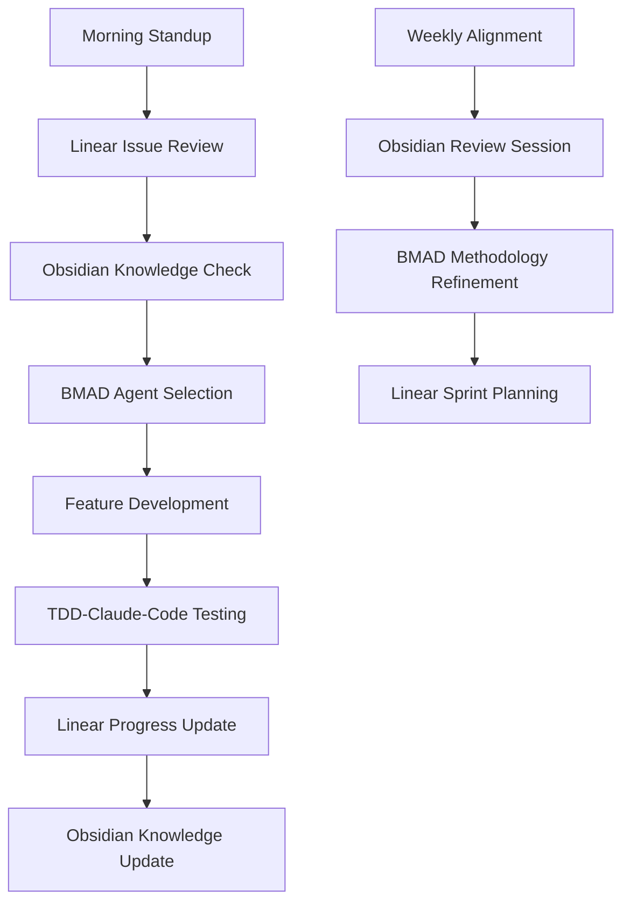

# BMAD Brownfield Integration Plan
## Dental Practice Dashboard - Strategic Framework Adoption

**Document Type**: Architectural Integration Strategy  
**Version**: 1.0  
**Status**: Draft  
**Generated**: 2025-06-21  
**Integration Target**: 50% Complete Next.js/Supabase Dental Dashboard  

---

## Executive Summary

This document outlines the strategic integration of the BMAD (Breakthrough Method of Agile AI-driven Development) framework into an existing dental practice dashboard project that is approximately 50% complete. The integration leverages BMAD's multi-tool coordination capabilities while preserving existing investments in architecture, testing infrastructure, and development workflows.

### Integration Objectives

- **Accelerate Completion**: Use BMAD's agent-driven approach to complete remaining 50% of features
- **Preserve Investments**: Maintain existing architecture, testing infrastructure, and working systems
- **Enhance Workflows**: Integrate Linear (project management) + Obsidian (knowledge alignment) + TDD-Claude-Code (development execution)
- **Risk Mitigation**: Ensure zero disruption to current production systems and team workflows
- **Quality Assurance**: Leverage BMAD's systematic approach to increase test coverage from 74% to 90%+

---

## 1. Current State Analysis

### Project Maturity Assessment

```typescript
// Current Architecture Strengths (Preserve & Build Upon)
const existingFoundation = {
  architecture: {
    status: "STRONG",
    frameworks: ["Next.js 15", "TypeScript 5.8.3", "Supabase", "Prisma"],
    patterns: ["Multi-tenant RLS", "Server Components", "Type Safety"],
    testing: "177 tests (74% passing)",
    infrastructure: "Local Supabase + Docker"
  },
  
  completionStatus: {
    authentication: "100%",     // Supabase Auth + SSR complete
    multiTenant: "95%",         // RLS + context switching complete
    uiFramework: "90%",         // Dashboard layout + shadcn/ui complete
    apiLayer: "80%",            // Standardized API utilities complete
    database: "85%",            // Schema + migrations mostly complete
    dataIntegration: "30%",     // Google Sheets sync partially implemented
    analytics: "40%",           // KPI calculations partially complete
    testing: "74%"              // Need to reach 90%+ coverage
  }
};
```

### Critical Integration Points

1. **Linear MCP Integration**
   - Project: Dental Dashboard (31deeedb-112f)
   - Team: AOJDevStudio (6b3573d9-0510-4503-b569-b92b37a36105)
   - Current issue tracking and sprint management

2. **Obsidian MCP Integration**
   - Central knowledge hub for BMAD methodology
   - Team alignment across distributed workflows
   - Documentation standardization and best practices

3. **Existing TDD-Claude-Code Workflows**
   - 177 tests with Vitest + Playwright
   - Local Supabase testing environment
   - Comprehensive pre-commit hooks with Biome

---

## 2. BMAD Framework Integration Strategy

### Phase 1: Foundation & Assessment (Week 1)

#### Step 1.1: BMAD Core Installation
```bash
# Install BMAD framework in existing project
cd /Users/ossieirondi/Projects/kamdental/dental-dashboard
npx bmad-method install

# Select existing project integration
# Choose: "Brownfield Enhancement"
# IDE: Claude Code (already in use)
```

#### Step 1.2: Core Configuration Setup
```yaml
# bmad-core/core-config.yml
project:
  type: brownfield
  completionPercentage: 50
  
prdVersion: v4
prdSharded: true
prdShardedLocation: docs/prd
architectureVersion: v4
architectureSharded: true
architectureShardedLocation: docs/architecture

devLoadAlwaysFiles:
  - "CLAUDE.md"
  - "docs/architecture/comprehensive-architecture-documentation.md"
  - "package.json"
  - "prisma/schema.prisma"
  - "src/lib/database/client.ts"

devDebugLog: "logs/bmad-dev-debug.log"
agentCoreDump: "docs/bmad-sessions/"

linear:
  projectId: "31deeedb-112f"
  teamId: "6b3573d9-0510-4503-b569-b92b37a36105"
  
obsidian:
  integrationEnabled: true
  knowledgeBase: "bmad-method-docs"
  alignmentReviews: "weekly"
```

#### Step 1.3: Existing Documentation Integration
```bash
# Create BMAD-compatible document structure
mkdir -p docs/bmad-integration
mkdir -p docs/prd
mkdir -p docs/architecture

# Migrate existing documentation
cp docs/architecture/comprehensive-architecture-documentation.md docs/bmad-integration/
cp CLAUDE.md docs/bmad-integration/project-context.md

# Create completion status document
```

### Phase 2: Multi-Tool Coordination Setup (Week 2)

#### Step 2.1: Linear Integration Configuration
```typescript
// Linear MCP Integration Points
const linearIntegration = {
  projectManagement: {
    currentProject: "Dental Dashboard",
    projectId: "31deeedb-112f",
    remainingFeatures: [
      "Google Sheets Data Integration",
      "Advanced Analytics Dashboard", 
      "Provider Performance Visualizations",
      "Test Coverage Enhancement"
    ]
  },
  
  bmadWorkflow: {
    epicCreation: "Linear issues → BMAD stories",
    progressTracking: "BMAD status → Linear updates",
    sprintPlanning: "Combined Linear + BMAD agent coordination"
  }
};
```

#### Step 2.2: Obsidian Knowledge Hub Setup
```markdown
# Obsidian Vault Structure for BMAD Alignment

## Core Knowledge Areas
- `/BMAD-Method/` - Framework documentation
- `/Dental-Dashboard/` - Project-specific knowledge
- `/Team-Alignment/` - Cross-team coordination
- `/Integration-Patterns/` - Brownfield best practices

## Alignment Workflows
- Weekly BMAD methodology reviews
- Team synchronization on agent usage
- Knowledge transfer sessions
- Best practice documentation
```

#### Step 2.3: TDD-Claude-Code Workflow Enhancement
```typescript
// Enhanced Testing Integration with BMAD
const testingIntegration = {
  currentInfrastructure: {
    vitest: "Unit/Integration tests with local Supabase",
    playwright: "E2E tests with cross-browser support",
    coverage: "74% → target 90%+"
  },
  
  bmadEnhancements: {
    agentTestCreation: "Test generation using BMAD dev agent",
    qualityAssurance: "QA agent for comprehensive test review",
    testArchitecture: "Architect agent for testing strategy",
    continuousImprovement: "Regular test coverage analysis"
  }
};
```

---

## 3. Phased Integration Approach

### Phase 3: Core Feature Completion (Weeks 3-6)

#### Week 3: Google Sheets Integration Completion
```yaml
# BMAD Agent Workflow: Google Sheets Feature
agents:
  analyst: 
    task: "Analyze existing Google Sheets integration patterns"
    input: "scripts/google-apps-script/ codebase"
    output: "Integration requirements document"
    
  architect:
    task: "Design robust data sync architecture"
    input: "Existing API patterns + Google Sheets requirements"
    output: "Data integration architecture specification"
    
  dev:
    task: "Implement remaining Google Sheets features"
    input: "Architecture spec + existing partial implementation"
    output: "Complete Google Sheets sync functionality"
    
  qa:
    task: "Comprehensive testing of Google Sheets integration"
    input: "Implemented features + test requirements"
    output: "Test suite for data sync functionality"
```

#### Week 4: Advanced Analytics Implementation
```typescript
// BMAD-Driven Analytics Completion
const analyticsWorkflow = {
  currentState: {
    basicKPIs: "Partially implemented",
    providerMetrics: "Foundation in place",
    dashboardVisualization: "UI components ready"
  },
  
  bmadImplementation: {
    analyst: "Define comprehensive KPI requirements",
    architect: "Design scalable analytics architecture", 
    dev: "Implement advanced calculation engines",
    uxExpert: "Enhance dashboard visualizations",
    qa: "Performance testing for large datasets"
  }
};
```

#### Week 5: Provider Performance Dashboard
```yaml
# Provider Performance Feature Sprint
epic: "Provider Performance Dashboard Completion"
stories:
  - "Performance Metrics Calculation Engine"
  - "Multi-location Provider Analytics"
  - "Real-time Performance Dashboards"
  - "Provider Comparison Visualizations"
  - "Goal Tracking and Variance Analysis"

bmadAgentFlow:
  sm: "Create detailed user stories from existing PRD"
  dev: "Implement performance calculation algorithms"
  uxExpert: "Design intuitive dashboard interfaces"
  qa: "Validate accuracy of performance calculations"
```

#### Week 6: Test Coverage Enhancement
```typescript
// Systematic Test Coverage Improvement
const testCoverageStrategy = {
  currentCoverage: "74%",
  targetCoverage: "90%+",
  
  bmadApproach: {
    qa: {
      task: "Audit existing test coverage",
      deliverable: "Test coverage gap analysis"
    },
    dev: {
      task: "Implement missing tests systematically",
      deliverable: "Comprehensive test suite"
    },
    architect: {
      task: "Design testing infrastructure improvements",
      deliverable: "Enhanced testing architecture"
    }
  }
};
```

---

## 4. Risk Mitigation & Safety Measures

### Production System Protection

```typescript
// Zero-Disruption Integration Safeguards
const safetyMeasures = {
  codebaseProtection: {
    branchStrategy: "feature/bmad-integration",
    mainBranchProtection: "All BMAD work in isolated branches",
    mergeGates: "Comprehensive testing before main branch merge"
  },
  
  infrastructureIsolation: {
    testingEnvironment: "Continue using local Supabase",
    productionDatabase: "No direct BMAD access to production",
    stagingValidation: "All features tested in staging first"
  },
  
  rollbackPlan: {
    configurationBackup: "Backup all existing configurations",
    dependencyLock: "Lock current working dependencies",
    quickRevert: "Fast rollback procedures documented"
  }
};
```

### Integration Validation Checkpoints

```yaml
# Mandatory Validation Gates
checkpoint1:
  description: "BMAD installation validation"
  criteria:
    - Existing tests still pass (74% minimum)
    - Development environment unchanged
    - No production dependencies affected

checkpoint2:
  description: "First feature completion validation"
  criteria:
    - Google Sheets integration working
    - Test coverage maintained or improved
    - No performance regressions

checkpoint3:
  description: "Full integration validation"
  criteria:
    - All remaining features completed
    - Test coverage at 90%+
    - Production deployment ready
```

---

## 5. Workflow Alignment & Tool Coordination

### Daily Development Workflow



### Multi-Tool Coordination Protocol

```typescript
// Coordinated Workflow Protocol
const workflowCoordination = {
  morningRoutine: {
    step1: "Check Linear for priority issues",
    step2: "Review Obsidian for team alignment updates",
    step3: "Select appropriate BMAD agent for daily work",
    step4: "Execute development with TDD-Claude-Code"
  },
  
  featureCompletion: {
    step1: "BMAD agent completes feature implementation",
    step2: "TDD-Claude-Code validates with comprehensive tests",
    step3: "Linear issue updated with completion status",
    step4: "Obsidian knowledge base updated with learnings"
  },
  
  weeklyAlignment: {
    step1: "Obsidian-driven team alignment session", 
    step2: "BMAD methodology review and refinement",
    step3: "Linear sprint planning with BMAD insights",
    step4: "Knowledge transfer and best practice updates"
  }
};
```

---

## 6. Completion Roadmap & Success Metrics

### 4-Week Completion Timeline

```yaml
Week 1: Foundation & Assessment
  deliverables:
    - BMAD framework installed and configured
    - Multi-tool integration validated
    - Risk mitigation measures in place
  success_criteria:
    - Zero production disruption
    - All existing tests passing
    - Team trained on BMAD workflows

Week 2: Core Infrastructure Enhancement  
  deliverables:
    - Enhanced testing infrastructure
    - Improved development workflows
    - Linear-Obsidian-BMAD coordination established
  success_criteria:
    - Development velocity increased
    - Test coverage improvement initiated
    - Team alignment on methodologies

Week 3-4: Feature Completion Sprint
  deliverables:
    - Google Sheets integration completed
    - Advanced analytics implemented
    - Provider performance dashboard finished
  success_criteria:
    - 90%+ test coverage achieved
    - All remaining features delivered
    - Production deployment ready

Week 5-6: Quality Assurance & Deployment
  deliverables:
    - Comprehensive QA validation
    - Production deployment
    - Team handoff and training
  success_criteria:
    - Zero critical bugs
    - Performance benchmarks met
    - Team fully trained on BMAD workflows
```

### Success Metrics & KPIs

```typescript
// Integration Success Measurement
const successMetrics = {
  technicalMetrics: {
    testCoverage: { current: "74%", target: "90%+" },
    featureCompletion: { current: "50%", target: "100%" },
    codeQuality: { current: "Good", target: "Excellent" },
    performanceMetrics: { maintain: "Current levels", improve: "Where possible" }
  },
  
  processMetrics: {
    developmentVelocity: "Measure story points per sprint",
    defectRate: "Track bugs per feature delivered", 
    teamAlignment: "Weekly alignment score",
    knowledgeSharing: "Documentation completeness score"
  },
  
  businessMetrics: {
    timeToMarket: "Accelerated feature delivery",
    qualityImprovement: "Reduced post-deployment issues",
    teamEfficiency: "Improved cross-team coordination",
    scalabilityReadiness: "Enhanced architecture patterns"
  }
};
```

---

## 7. Knowledge Management & Team Alignment

### Obsidian Knowledge Hub Structure

```markdown
# Dental Dashboard BMAD Knowledge Vault

## 1. BMAD Methodology
- Framework Overview
- Agent Selection Guidelines  
- Workflow Best Practices
- Integration Patterns

## 2. Project Context
- Architecture Documentation
- Current Feature Status
- Technical Debt Assessment
- Integration Requirements

## 3. Team Coordination
- Daily Workflow Protocols
- Sprint Planning Templates
- Knowledge Transfer Sessions
- Alignment Review Process

## 4. Lessons Learned
- Integration Challenges
- Best Practice Evolution
- Tool Effectiveness Analysis
- Continuous Improvement Log
```

### Weekly Alignment Protocol

```yaml
# Weekly BMAD Alignment Session (1 hour)
agenda:
  - Review previous week's BMAD agent effectiveness
  - Analyze completed features and quality metrics
  - Plan upcoming sprint with optimal agent selection
  - Update Obsidian knowledge base with learnings
  - Refine Linear-BMAD integration processes

deliverables:
  - Updated team alignment documentation
  - Refined BMAD methodology for project context
  - Clear sprint plan with agent assignments
  - Knowledge base updates for future reference
```

---

## 8. Implementation Action Plan

### Immediate Actions (Next 48 Hours)

```bash
# 1. Install BMAD Framework
cd /Users/ossieirondi/Projects/kamdental/dental-dashboard
npx bmad-method install

# 2. Create Integration Branch
git checkout -b feature/bmad-integration
git push -u origin feature/bmad-integration

# 3. Setup Core Configuration
mkdir -p bmad-core
# Create core-config.yml with project-specific settings

# 4. Document Current State
mkdir -p docs/bmad-integration
# Move relevant documentation to BMAD structure

# 5. Validate Integration
npm test  # Ensure all existing tests pass
npm run biome:check  # Ensure code quality maintained
```

### Sprint 1 Planning (Week 1)

```yaml
sprint_goal: "Seamless BMAD integration without production disruption"

stories:
  - title: "Install and configure BMAD framework"
    agent: "bmad-master"
    acceptance_criteria:
      - BMAD core installed in project
      - Core configuration completed
      - All existing tests passing

  - title: "Setup multi-tool coordination"
    agent: "bmad-orchestrator"  
    acceptance_criteria:
      - Linear MCP integration validated
      - Obsidian knowledge hub created
      - TDD-Claude-Code workflows enhanced

  - title: "Create integration documentation"
    agent: "pm"
    acceptance_criteria:
      - Integration plan documented
      - Risk mitigation measures defined
      - Team training materials created
```

---

## 9. Conclusion & Next Steps

### Strategic Benefits of BMAD Integration

1. **Accelerated Development**: Leverage specialized AI agents for remaining 50% of features
2. **Enhanced Quality**: Systematic QA approach to achieve 90%+ test coverage
3. **Improved Coordination**: Multi-tool integration for better team alignment
4. **Risk Mitigation**: Structured approach preserves existing investments
5. **Knowledge Management**: Obsidian-based knowledge hub for continuous improvement

### Immediate Next Steps

1. **Execute Installation**: Follow implementation action plan
2. **Validate Integration**: Ensure zero disruption to existing workflows
3. **Begin Feature Completion**: Start with Google Sheets integration
4. **Monitor Progress**: Track success metrics throughout integration
5. **Team Training**: Ensure all team members understand BMAD workflows

### Long-term Strategic Value

The BMAD integration positions the dental dashboard project for:
- **Scalable Development Processes**: Repeatable agent-driven workflows
- **Enhanced Code Quality**: Systematic testing and validation approaches  
- **Improved Team Coordination**: Multi-tool integration for distributed teams
- **Knowledge Preservation**: Comprehensive documentation and best practices
- **Future Feature Development**: Established patterns for rapid feature delivery

This brownfield integration plan provides a comprehensive roadmap for adopting BMAD methodology while preserving existing investments and accelerating project completion. The phased approach ensures minimal risk while maximizing the strategic benefits of AI-driven development workflows.

---

**Document Status**: Ready for Implementation  
**Approval Required**: Development Team Lead  
**Timeline**: 6-week integration and completion plan  
**Risk Level**: Low (comprehensive safeguards in place)