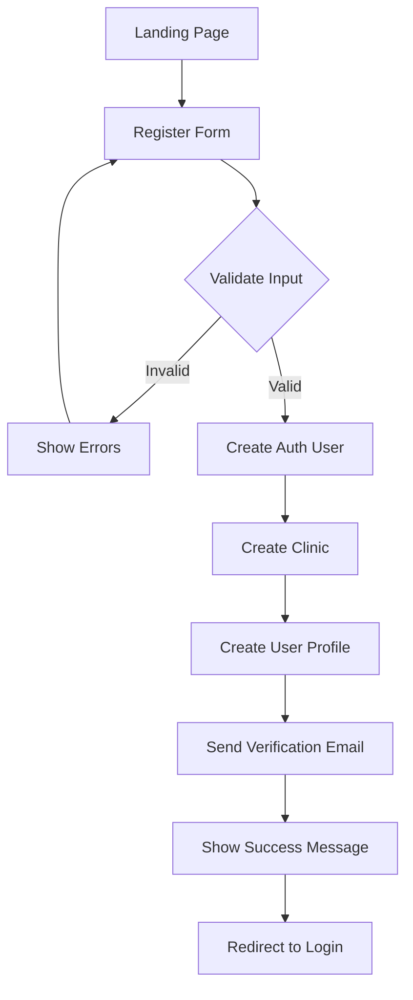
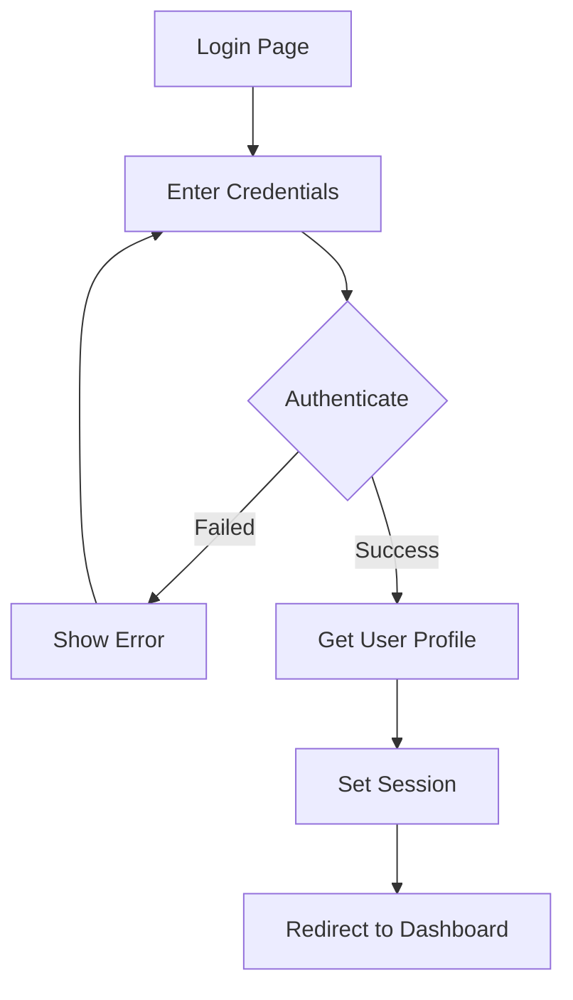
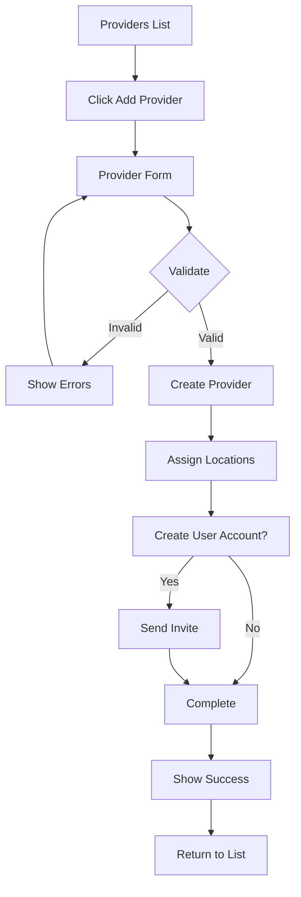
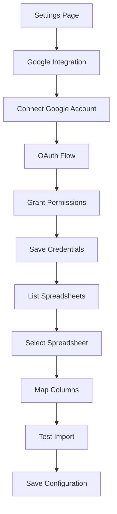
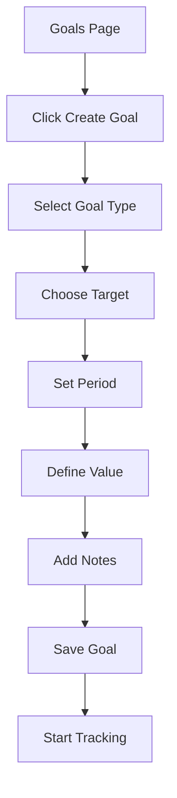
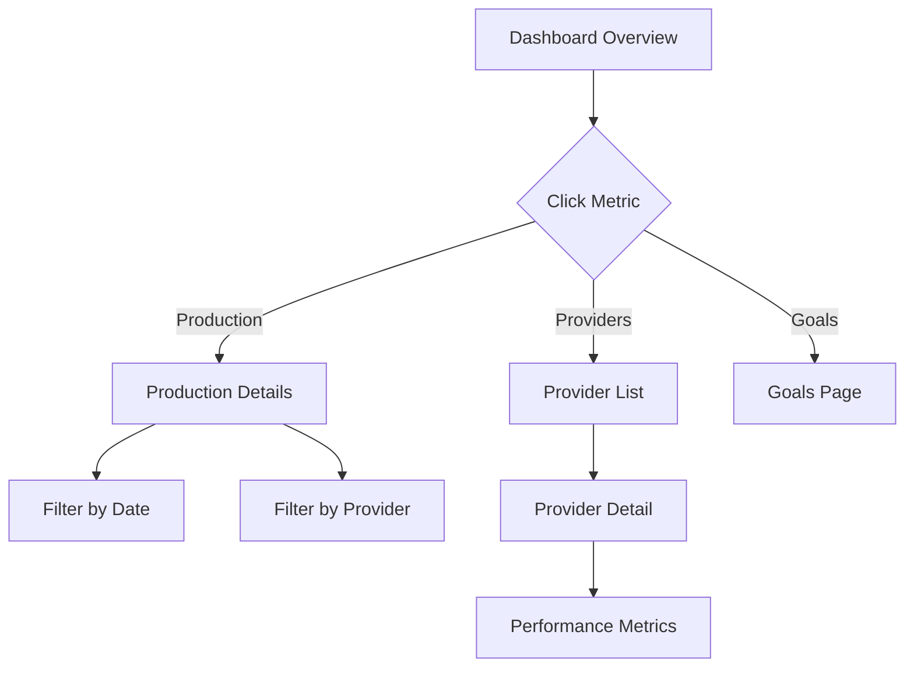

# Core Workflows

## Overview

This document describes the major user journeys and interaction flows within the Dental Dashboard. Each workflow details the steps, screens, data flow, and business logic involved in completing key tasks.

## Quick Reference

| Workflow | Purpose | Primary Users |
|----------|---------|---------------|
| User Registration | Create new clinic account | New users |
| Provider Management | Add/edit provider profiles | Office Managers |
| Data Synchronization | Import from Google Sheets | Office Managers |
| Goal Setting | Define performance targets | Office Managers |
| Dashboard Analysis | View KPIs and metrics | All users |

## Authentication Workflows

### User Registration Flow

Complete flow for new clinic registration.



**Steps:**

1. **Landing Page**
   - User clicks "Get Started" or "Register"
   - Route: `/register`

2. **Registration Form**
   ```typescript
   // Required fields
   {
     email: string
     password: string
     fullName: string
     clinicName: string
     clinicAddress: string
     phoneNumber: string
     role: 'office_manager' // Default for first user
   }
   ```

3. **Validation**
   - Email format and uniqueness
   - Password strength (8+ chars, uppercase, lowercase, number)
   - Required fields presence

4. **Account Creation**
   ```typescript
   // API: POST /api/auth/register-comprehensive
   async function registerUser(data: RegistrationData) {
     // 1. Create Supabase auth user
     const { user } = await supabase.auth.signUp({
       email: data.email,
       password: data.password,
       options: {
         data: { full_name: data.fullName }
       }
     })
     
     // 2. Create clinic record
     const clinic = await prisma.clinic.create({
       data: {
         name: data.clinicName,
         address: data.clinicAddress,
         // ... other fields
       }
     })
     
     // 3. Create user profile
     const profile = await prisma.user.create({
       data: {
         id: user.id,
         email: data.email,
         fullName: data.fullName,
         clinicId: clinic.id,
         role: 'office_manager'
       }
     })
   }
   ```

5. **Email Verification**
   - Verification email sent automatically
   - User must verify before full access
   - Route: `/auth/verify-email`

### Login Flow



**Implementation:**
```typescript
// app/(auth)/login/page.tsx
async function handleLogin(credentials: LoginCredentials) {
  try {
    // 1. Authenticate with Supabase
    const { data, error } = await supabase.auth.signInWithPassword({
      email: credentials.email,
      password: credentials.password
    })
    
    if (error) throw error
    
    // 2. Get user profile with clinic
    const profile = await getUserProfile(data.user.id)
    
    // 3. Redirect based on role
    const destination = getDefaultRoute(profile.role)
    router.push(destination)
  } catch (error) {
    setError('Invalid email or password')
  }
}
```

### Password Reset Flow

1. **Request Reset**
   - User enters email
   - System sends reset link
   - Email contains secure token

2. **Reset Password**
   - User clicks email link
   - Lands on reset form
   - Enters new password
   - Password updated

## Provider Management Workflows

### Add New Provider

Complete flow for adding a provider to the system.



**Steps:**

1. **Navigate to Providers**
   ```typescript
   // Route: /providers
   // User must have 'write:providers' permission
   ```

2. **Open Add Form**
   ```typescript
   <Dialog open={isOpen} onOpenChange={setIsOpen}>
     <DialogTrigger asChild>
       <Button>
         <Plus className="mr-2 h-4 w-4" />
         Add Provider
       </Button>
     </DialogTrigger>
     <DialogContent>
       <ProviderForm onSubmit={handleSubmit} />
     </DialogContent>
   </Dialog>
   ```

3. **Fill Provider Details**
   ```typescript
   interface ProviderFormData {
     // Personal Info
     firstName: string
     lastName: string
     email: string
     phoneNumber?: string
     
     // Professional Info
     type: 'dentist' | 'hygienist' | 'assistant'
     specialty?: string
     licenseNumber: string
     licenseState: string
     
     // Assignment
     locationIds: string[]
     primaryLocationId?: string
     
     // Optional
     createUserAccount: boolean
   }
   ```

4. **Location Assignment**
   ```typescript
   // Multi-select locations
   <FormField
     name="locationIds"
     render={({ field }) => (
       <FormItem>
         <FormLabel>Practice Locations</FormLabel>
         <MultiSelect
           options={locations}
           selected={field.value}
           onChange={field.onChange}
         />
         <FormDescription>
           Select all locations where this provider works
         </FormDescription>
       </FormItem>
     )}
   />
   ```

5. **Save Provider**
   ```typescript
   // API: POST /api/providers
   async function createProvider(data: ProviderFormData) {
     const provider = await prisma.provider.create({
       data: {
         ...data,
         clinicId: currentUser.clinicId,
         locations: {
           create: data.locationIds.map(id => ({
             locationId: id,
             isPrimary: id === data.primaryLocationId
           }))
         }
       }
     })
     
     if (data.createUserAccount) {
       await inviteProviderUser(provider)
     }
     
     return provider
   }
   ```

### Edit Provider Information

1. **Select Provider**
   - Click on provider card or edit button
   - Route: `/providers/[id]/edit`

2. **Load Current Data**
   - Fetch provider details
   - Populate form with existing values

3. **Make Changes**
   - Update desired fields
   - Validation on change

4. **Save Updates**
   - API: PUT `/api/providers/[id]`
   - Update only changed fields
   - Refresh provider list

### Manage Provider Locations

```typescript
// Route: /providers/[id]/locations
interface LocationManagement {
  currentLocations: ProviderLocation[]
  availableLocations: Location[]
  
  // Actions
  addLocation: (locationId: string) => void
  removeLocation: (locationId: string) => void
  setPrimary: (locationId: string) => void
}
```

## Data Synchronization Workflows

### Google Sheets Connection

Initial setup for Google Sheets integration.



**OAuth Setup:**
```typescript
// Route: /api/auth/google/connect
export async function GET(request: Request) {
  const authUrl = oauth2Client.generateAuthUrl({
    access_type: 'offline',
    scope: [
      'https://www.googleapis.com/auth/spreadsheets.readonly',
      'https://www.googleapis.com/auth/drive.readonly'
    ],
    state: clinicId // Pass clinic context
  })
  
  return Response.redirect(authUrl)
}

// Callback handling
// Route: /api/auth/google/callback
export async function GET(request: Request) {
  const { code, state: clinicId } = parseQuery(request.url)
  
  const { tokens } = await oauth2Client.getToken(code)
  
  await saveClinicGoogleCredentials(clinicId, tokens)
  
  return Response.redirect('/settings/integrations?connected=true')
}
```

### Manual Data Sync

User-triggered synchronization process.

```typescript
// UI Component
function SyncButton({ spreadsheetId }: Props) {
  const [syncing, setSyncing] = useState(false)
  const [progress, setProgress] = useState(0)
  
  async function handleSync() {
    setSyncing(true)
    
    try {
      // Start sync
      const { syncId } = await startSync(spreadsheetId)
      
      // Poll for progress
      const interval = setInterval(async () => {
        const status = await getSyncStatus(syncId)
        
        setProgress(status.progress)
        
        if (status.completed) {
          clearInterval(interval)
          setSyncing(false)
          toast.success(`Synced ${status.recordsProcessed} records`)
        }
      }, 1000)
    } catch (error) {
      toast.error('Sync failed')
      setSyncing(false)
    }
  }
  
  return (
    <Button onClick={handleSync} disabled={syncing}>
      {syncing ? (
        <>
          <Loader2 className="mr-2 h-4 w-4 animate-spin" />
          Syncing... {progress}%
        </>
      ) : (
        <>
          <RefreshCw className="mr-2 h-4 w-4" />
          Sync Now
        </>
      )}
    </Button>
  )
}
```

### Column Mapping

Process for mapping spreadsheet columns to database fields.

```typescript
interface ColumnMapping {
  spreadsheetColumn: string
  databaseField: string
  dataType: string
  required: boolean
  transform?: string
}

// Mapping UI
function ColumnMapper({ 
  headers, 
  mappings, 
  onChange 
}: ColumnMapperProps) {
  return (
    <Table>
      <TableHeader>
        <TableRow>
          <TableHead>Spreadsheet Column</TableHead>
          <TableHead>Maps To</TableHead>
          <TableHead>Type</TableHead>
          <TableHead>Required</TableHead>
        </TableRow>
      </TableHeader>
      <TableBody>
        {headers.map(header => (
          <TableRow key={header}>
            <TableCell>{header}</TableCell>
            <TableCell>
              <Select
                value={mappings[header]?.databaseField}
                onValueChange={(value) => 
                  onChange(header, { databaseField: value })
                }
              >
                <SelectTrigger>
                  <SelectValue placeholder="Select field" />
                </SelectTrigger>
                <SelectContent>
                  <SelectItem value="provider_name">
                    Provider Name
                  </SelectItem>
                  <SelectItem value="production_amount">
                    Production Amount
                  </SelectItem>
                  {/* More options */}
                </SelectContent>
              </Select>
            </TableCell>
            <TableCell>
              {mappings[header]?.dataType || 'string'}
            </TableCell>
            <TableCell>
              <Checkbox
                checked={mappings[header]?.required}
                disabled
              />
            </TableCell>
          </TableRow>
        ))}
      </TableBody>
    </Table>
  )
}
```

## Goal Management Workflows

### Create New Goal



**Goal Creation Form:**
```typescript
function GoalForm({ onSubmit }: Props) {
  const form = useForm<GoalInput>({
    defaultValues: {
      type: 'production',
      period: 'monthly',
      year: new Date().getFullYear(),
      month: new Date().getMonth() + 1
    }
  })
  
  return (
    <Form {...form}>
      <form onSubmit={form.handleSubmit(onSubmit)}>
        {/* Goal Type */}
        <FormField
          name="type"
          render={({ field }) => (
            <FormItem>
              <FormLabel>Goal Type</FormLabel>
              <RadioGroup
                value={field.value}
                onValueChange={field.onChange}
              >
                <div className="flex items-center space-x-2">
                  <RadioGroupItem value="production" />
                  <Label>Production</Label>
                </div>
                <div className="flex items-center space-x-2">
                  <RadioGroupItem value="collection" />
                  <Label>Collection</Label>
                </div>
                <div className="flex items-center space-x-2">
                  <RadioGroupItem value="new_patients" />
                  <Label>New Patients</Label>
                </div>
              </RadioGroup>
            </FormItem>
          )}
        />
        
        {/* Target Selection */}
        <FormField
          name="providerId"
          render={({ field }) => (
            <FormItem>
              <FormLabel>Target</FormLabel>
              <Select
                value={field.value}
                onValueChange={field.onChange}
              >
                <SelectTrigger>
                  <SelectValue placeholder="Select target" />
                </SelectTrigger>
                <SelectContent>
                  <SelectItem value="clinic">
                    Entire Clinic
                  </SelectItem>
                  <SelectGroup>
                    <SelectLabel>Providers</SelectLabel>
                    {providers.map(provider => (
                      <SelectItem 
                        key={provider.id} 
                        value={provider.id}
                      >
                        {provider.name}
                      </SelectItem>
                    ))}
                  </SelectGroup>
                </SelectContent>
              </Select>
            </FormItem>
          )}
        />
        
        {/* Period Selection */}
        <div className="grid grid-cols-2 gap-4">
          <FormField
            name="period"
            render={({ field }) => (
              <FormItem>
                <FormLabel>Period</FormLabel>
                <Select
                  value={field.value}
                  onValueChange={field.onChange}
                >
                  <SelectTrigger>
                    <SelectValue />
                  </SelectTrigger>
                  <SelectContent>
                    <SelectItem value="monthly">Monthly</SelectItem>
                    <SelectItem value="quarterly">Quarterly</SelectItem>
                    <SelectItem value="annual">Annual</SelectItem>
                  </SelectContent>
                </Select>
              </FormItem>
            )}
          />
          
          {/* Dynamic period fields */}
          {form.watch('period') === 'monthly' && (
            <FormField
              name="month"
              render={({ field }) => (
                <FormItem>
                  <FormLabel>Month</FormLabel>
                  <Select
                    value={field.value?.toString()}
                    onValueChange={(v) => field.onChange(parseInt(v))}
                  >
                    <SelectTrigger>
                      <SelectValue />
                    </SelectTrigger>
                    <SelectContent>
                      {months.map((month, index) => (
                        <SelectItem 
                          key={index} 
                          value={(index + 1).toString()}
                        >
                          {month}
                        </SelectItem>
                      ))}
                    </SelectContent>
                  </Select>
                </FormItem>
              )}
            />
          )}
        </div>
        
        {/* Target Value */}
        <FormField
          name="target"
          render={({ field }) => (
            <FormItem>
              <FormLabel>Target Value</FormLabel>
              <FormControl>
                <Input
                  type="number"
                  placeholder={
                    form.watch('type') === 'new_patients' 
                      ? "Number of patients" 
                      : "Dollar amount"
                  }
                  {...field}
                  onChange={(e) => field.onChange(parseFloat(e.target.value))}
                />
              </FormControl>
              <FormDescription>
                {form.watch('type') === 'new_patients' 
                  ? "Enter the number of new patients"
                  : "Enter the dollar amount (no commas or $)"
                }
              </FormDescription>
            </FormItem>
          )}
        />
        
        <Button type="submit">Create Goal</Button>
      </form>
    </Form>
  )
}
```

### Track Goal Progress

Automatic tracking and visualization of goal progress.

```typescript
// Goal tracking logic
async function updateGoalProgress(goalId: string) {
  const goal = await prisma.goal.findUnique({
    where: { id: goalId }
  })
  
  // Calculate actual based on goal type
  let actual = 0
  
  switch (goal.type) {
    case 'production':
      actual = await calculateProduction({
        providerId: goal.providerId,
        startDate: getGoalStartDate(goal),
        endDate: getGoalEndDate(goal)
      })
      break
      
    case 'new_patients':
      actual = await countNewPatients({
        providerId: goal.providerId,
        startDate: getGoalStartDate(goal),
        endDate: getGoalEndDate(goal)
      })
      break
  }
  
  // Update goal with actual
  await prisma.goal.update({
    where: { id: goalId },
    data: { 
      actual,
      status: determineGoalStatus(goal.target, actual)
    }
  })
  
  // Check for alerts
  await checkGoalAlerts(goal, actual)
}
```

## Dashboard Analysis Workflows

### View Dashboard Metrics

Main dashboard interaction flow.

```typescript
// Route: /dashboard
interface DashboardView {
  period: DateRange
  filters: {
    location?: string
    provider?: string
  }
  metrics: {
    financial: FinancialMetrics
    operational: OperationalMetrics
    goals: GoalProgress[]
  }
}

// Period selector component
function PeriodSelector({ value, onChange }: Props) {
  return (
    <Select value={value} onValueChange={onChange}>
      <SelectTrigger className="w-[180px]">
        <SelectValue />
      </SelectTrigger>
      <SelectContent>
        <SelectItem value="today">Today</SelectItem>
        <SelectItem value="week">This Week</SelectItem>
        <SelectItem value="month">This Month</SelectItem>
        <SelectItem value="quarter">This Quarter</SelectItem>
        <SelectItem value="year">This Year</SelectItem>
        <SelectItem value="custom">Custom Range</SelectItem>
      </SelectContent>
    </Select>
  )
}
```

### Drill-Down Analysis

Navigate from summary to detailed views.



### Export Reports

Generate and download reports.

```typescript
// Export workflow
async function exportReport(params: ExportParams) {
  // 1. Gather data
  const data = await gatherReportData(params)
  
  // 2. Format based on type
  let formatted: Blob
  
  switch (params.format) {
    case 'csv':
      formatted = await formatAsCSV(data)
      break
    case 'pdf':
      formatted = await formatAsPDF(data)
      break
    case 'excel':
      formatted = await formatAsExcel(data)
      break
  }
  
  // 3. Download
  downloadFile(formatted, `report-${params.type}-${Date.now()}.${params.format}`)
}

// Export UI
function ExportButton({ reportType }: Props) {
  const [exporting, setExporting] = useState(false)
  
  async function handleExport(format: ExportFormat) {
    setExporting(true)
    
    try {
      await exportReport({
        type: reportType,
        format,
        period: currentPeriod,
        filters: currentFilters
      })
      
      toast.success('Report exported successfully')
    } catch (error) {
      toast.error('Export failed')
    } finally {
      setExporting(false)
    }
  }
  
  return (
    <DropdownMenu>
      <DropdownMenuTrigger asChild>
        <Button variant="outline" disabled={exporting}>
          <Download className="mr-2 h-4 w-4" />
          Export
        </Button>
      </DropdownMenuTrigger>
      <DropdownMenuContent>
        <DropdownMenuItem onClick={() => handleExport('csv')}>
          Export as CSV
        </DropdownMenuItem>
        <DropdownMenuItem onClick={() => handleExport('pdf')}>
          Export as PDF
        </DropdownMenuItem>
        <DropdownMenuItem onClick={() => handleExport('excel')}>
          Export as Excel
        </DropdownMenuItem>
      </DropdownMenuContent>
    </DropdownMenu>
  )
}
```

## Error Handling in Workflows

### Validation Errors

```typescript
// Form validation with user-friendly messages
const handleSubmit = async (data: FormData) => {
  try {
    await submitForm(data)
  } catch (error) {
    if (error instanceof ValidationError) {
      // Show field-specific errors
      error.errors.forEach(err => {
        form.setError(err.field, {
          message: err.message
        })
      })
    } else {
      // Show general error
      toast.error('Something went wrong. Please try again.')
    }
  }
}
```

### Network Errors

```typescript
// Retry logic for network failures
async function fetchWithRetry(url: string, options?: RequestInit) {
  let lastError: Error
  
  for (let i = 0; i < 3; i++) {
    try {
      const response = await fetch(url, options)
      
      if (!response.ok) {
        throw new Error(`HTTP ${response.status}`)
      }
      
      return response
    } catch (error) {
      lastError = error
      
      // Show temporary error message
      if (i < 2) {
        toast.warning('Connection issue. Retrying...')
        await delay(1000 * Math.pow(2, i))
      }
    }
  }
  
  // Final failure
  toast.error('Unable to connect. Please check your internet connection.')
  throw lastError
}
```

### Permission Errors

```typescript
// Handle unauthorized access
function PermissionGuard({ 
  required, 
  children, 
  fallback 
}: PermissionGuardProps) {
  const { user } = useAuth()
  
  if (!hasPermission(user, required)) {
    return fallback || (
      <Alert variant="destructive">
        <AlertTitle>Access Denied</AlertTitle>
        <AlertDescription>
          You don't have permission to view this content.
          Please contact your administrator.
        </AlertDescription>
      </Alert>
    )
  }
  
  return children
}
```

## Loading States in Workflows

### Skeleton Screens

```typescript
// Show skeleton while loading
function ProviderListPage() {
  const { data, isLoading } = useProviders()
  
  if (isLoading) {
    return (
      <div className="space-y-4">
        <Skeleton className="h-10 w-48" /> {/* Title */}
        <div className="grid grid-cols-3 gap-4">
          {Array.from({ length: 6 }).map((_, i) => (
            <Card key={i}>
              <CardHeader>
                <Skeleton className="h-4 w-32" />
                <Skeleton className="h-3 w-24" />
              </CardHeader>
              <CardContent>
                <Skeleton className="h-20 w-full" />
              </CardContent>
            </Card>
          ))}
        </div>
      </div>
    )
  }
  
  return <ProviderGrid providers={data} />
}
```

### Progressive Loading

```typescript
// Load critical data first
function DashboardPage() {
  // Critical data - blocks render
  const { data: criticalMetrics } = useQuery({
    queryKey: ['dashboard', 'critical'],
    queryFn: fetchCriticalMetrics
  })
  
  // Non-critical - loads progressively
  const { data: charts } = useQuery({
    queryKey: ['dashboard', 'charts'],
    queryFn: fetchChartData,
    enabled: !!criticalMetrics
  })
  
  return (
    <div>
      {/* Show critical metrics immediately */}
      <MetricsGrid data={criticalMetrics} />
      
      {/* Charts load when ready */}
      <Suspense fallback={<ChartSkeleton />}>
        {charts && <ChartGrid data={charts} />}
      </Suspense>
    </div>
  )
}
```

## Mobile Workflows

### Responsive Navigation

```typescript
// Mobile-first navigation
function MobileNav() {
  const [open, setOpen] = useState(false)
  
  return (
    <>
      <Button
        variant="ghost"
        className="md:hidden"
        onClick={() => setOpen(true)}
      >
        <Menu className="h-5 w-5" />
      </Button>
      
      <Sheet open={open} onOpenChange={setOpen}>
        <SheetContent side="left" className="w-[250px]">
          <nav className="flex flex-col space-y-4">
            {navigation.map(item => (
              <Link
                key={item.href}
                href={item.href}
                onClick={() => setOpen(false)}
                className="flex items-center space-x-2"
              >
                <item.icon className="h-5 w-5" />
                <span>{item.name}</span>
              </Link>
            ))}
          </nav>
        </SheetContent>
      </Sheet>
    </>
  )
}
```

### Touch Interactions

```typescript
// Swipe to delete on mobile
function SwipeableProviderCard({ provider, onDelete }: Props) {
  const handlers = useSwipeable({
    onSwipedLeft: () => {
      // Show delete confirmation
      setShowDelete(true)
    },
    preventDefaultTouchmoveEvent: true,
    trackMouse: true
  })
  
  return (
    <div {...handlers} className="relative">
      <ProviderCard provider={provider} />
      {showDelete && (
        <div className="absolute inset-y-0 right-0 flex items-center pr-4">
          <Button
            variant="destructive"
            size="sm"
            onClick={() => onDelete(provider.id)}
          >
            Delete
          </Button>
        </div>
      )}
    </div>
  )
}
```

## Related Resources

- [Frontend Architecture](./frontend-architecture.md) - Technical implementation
- [UI/UX Specifications](./ui-ux-spec.md) - Design guidelines
- [Component Specifications](./components.md) - Component details

---

**Last Updated**: December 2024
**Navigation**: [Back to Architecture Index](./index.md)