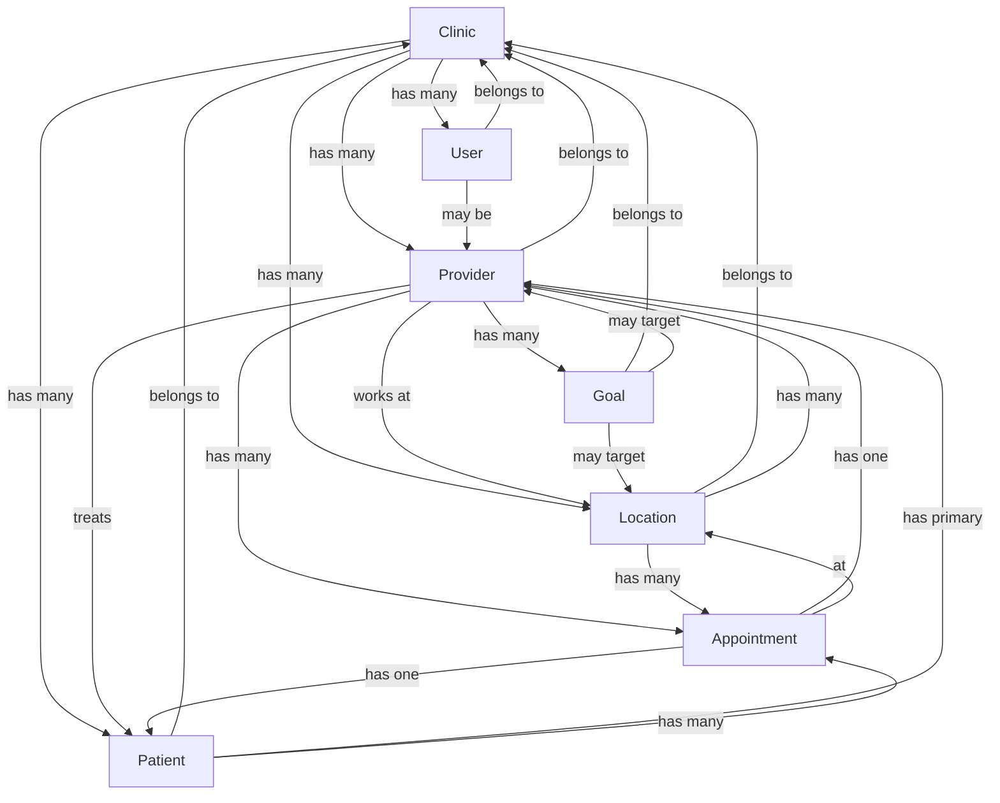

# Data Models

## Overview

This document defines all business entities, their properties, validation rules, and relationships within the Dental Dashboard system. These models represent the core data structures used throughout the application.

## Quick Reference

| Entity | Purpose | Key Relationships |
|--------|---------|-------------------|
| User | System users and authentication | Clinic, Provider |
| Clinic | Dental practice organization | Users, Providers, Locations |
| Provider | Dentists and hygienists | Clinic, Locations, Appointments |
| Patient | Dental patients | Appointments, Treatments |
| Appointment | Scheduled visits | Provider, Patient, Location |
| Financial | Production and collection data | Provider, Location, Appointment |

## Core Entities

### User

Represents authenticated users of the system.

```typescript
interface User {
  // Identifiers
  id: string                    // UUID
  email: string                 // Unique email address
  
  // Profile
  fullName: string             // Display name
  phoneNumber?: string         // Contact number
  avatarUrl?: string           // Profile image URL
  
  // Authentication
  role: UserRole               // System role
  isActive: boolean            // Account status
  emailVerified: boolean       // Email verification status
  lastLoginAt?: Date           // Last successful login
  
  // Multi-tenancy
  clinicId: string             // Primary clinic association
  clinics: Clinic[]            // All accessible clinics
  currentClinicId?: string     // Active clinic in session
  
  // Provider Link
  providerId?: string          // If user is also a provider
  provider?: Provider          // Provider profile
  
  // Metadata
  createdAt: Date
  updatedAt: Date
}

enum UserRole {
  ADMIN = 'admin',                    // System administrator
  OFFICE_MANAGER = 'office_manager',  // Clinic management
  PROVIDER = 'provider',              // Dentist/Hygienist
  FRONT_DESK = 'front_desk',         // Reception staff
  VIEWER = 'viewer'                   // Read-only access
}

// Validation Rules
const UserValidation = {
  email: z.string().email().max(255),
  fullName: z.string().min(2).max(100),
  phoneNumber: z.string().regex(/^\+?[1-9]\d{1,14}$/),
  password: z.string().min(8).regex(/^(?=.*[a-z])(?=.*[A-Z])(?=.*\d)/)
}
```

### Clinic

Represents a dental practice organization.

```typescript
interface Clinic {
  // Identifiers
  id: string                   // UUID
  name: string                 // Clinic name
  
  // Contact Information
  address: string              // Street address
  city: string                 // City
  state: string                // State/Province
  zipCode: string              // Postal code
  country: string              // Country code (default: 'US')
  phoneNumber: string          // Main contact number
  email?: string               // General email
  website?: string             // Clinic website
  
  // Business Information
  taxId?: string               // Tax identification
  npi?: string                 // National Provider Identifier
  licenseNumber?: string       // State license
  
  // Configuration
  timezone: string             // IANA timezone (e.g., 'America/New_York')
  currency: string             // ISO 4217 code (default: 'USD')
  dateFormat: string           // Preferred date format
  
  // Features
  settings: ClinicSettings     // Clinic-specific settings
  subscription: Subscription   // Billing plan
  
  // Status
  isActive: boolean            // Operational status
  trialEndsAt?: Date          // Trial expiration
  
  // Relationships
  users: User[]                // All clinic users
  providers: Provider[]        // All providers
  locations: Location[]        // Physical locations
  
  // Metadata
  createdAt: Date
  updatedAt: Date
}

interface ClinicSettings {
  workingHours: WorkingHours
  appointmentDuration: number   // Default minutes
  bufferTime: number           // Minutes between appointments
  allowOnlineBooking: boolean
  requireInsurance: boolean
  autoConfirmAppointments: boolean
}

interface WorkingHours {
  [key: string]: {             // monday, tuesday, etc.
    open: string               // HH:MM format
    close: string              // HH:MM format
    breaks?: Break[]
  }
}
```

### Provider

Represents dentists, hygienists, and other medical staff.

```typescript
interface Provider {
  // Identifiers
  id: string                   // UUID (transitioning from CUID)
  employeeId?: string          // Internal employee ID
  
  // Personal Information
  firstName: string            // Legal first name
  lastName: string             // Legal last name
  displayName: string          // Preferred display name
  email: string                // Professional email
  phoneNumber?: string         // Direct phone
  
  // Professional Information
  type: ProviderType           // Role classification
  specialty?: string           // Dental specialty
  licenseNumber: string        // Professional license
  licenseState: string         // License issuing state
  licenseExpiry?: Date         // License expiration
  npi?: string                 // National Provider ID
  deaNumber?: string           // DEA registration
  
  // Employment
  clinicId: string             // Primary clinic
  locations: ProviderLocation[] // Assigned locations
  primaryLocationId?: string   // Main practice location
  hireDate?: Date             // Employment start
  terminationDate?: Date      // Employment end
  employmentType: EmploymentType
  
  // Scheduling
  workSchedule: WorkSchedule   // Regular hours
  colorCode?: string          // Calendar color
  
  // Performance Tracking
  productionGoals?: Goal[]     // Financial targets
  metrics?: ProviderMetrics    // Performance data
  
  // Profile
  biography?: string           // Professional bio
  photoUrl?: string           // Profile photo
  specializations: string[]    // Areas of expertise
  languages: string[]          // Spoken languages
  
  // Status
  isActive: boolean            // Currently practicing
  isAcceptingPatients: boolean // New patient availability
  
  // User Account
  userId?: string              // Linked user account
  user?: User
  
  // Metadata
  createdAt: Date
  updatedAt: Date
}

enum ProviderType {
  DENTIST = 'dentist',
  HYGIENIST = 'hygienist', 
  ASSISTANT = 'assistant',
  SPECIALIST = 'specialist'
}

enum EmploymentType {
  FULL_TIME = 'full_time',
  PART_TIME = 'part_time',
  CONTRACT = 'contract',
  TEMPORARY = 'temporary'
}

interface ProviderLocation {
  providerId: string
  locationId: string
  location: Location
  isPrimary: boolean
  assignedAt: Date
  schedule?: LocationSchedule
}

// Validation Rules
const ProviderValidation = {
  email: z.string().email(),
  licenseNumber: z.string().min(5).max(20),
  npi: z.string().regex(/^\d{10}$/),
  deaNumber: z.string().regex(/^[A-Z]{2}\d{7}$/),
  phoneNumber: z.string().regex(/^\+?[1-9]\d{1,14}$/)
}
```

### Location

Represents physical clinic locations.

```typescript
interface Location {
  // Identifiers
  id: string                   // UUID
  code?: string               // Location code/abbreviation
  
  // Basic Information
  name: string                // Location name
  type: LocationType          // Facility type
  
  // Address
  address: string             // Street address
  address2?: string           // Suite/Unit
  city: string
  state: string
  zipCode: string
  country: string
  coordinates?: {
    latitude: number
    longitude: number
  }
  
  // Contact
  phoneNumber: string         // Main phone
  faxNumber?: string         // Fax
  email?: string             // Location email
  
  // Operations
  clinicId: string           // Parent clinic
  clinic: Clinic
  managers: User[]           // Location managers
  operatingHours: WorkingHours
  holidaySchedule: Holiday[]
  
  // Facilities
  operatories: number        // Number of chairs
  equipment: Equipment[]     // Major equipment
  amenities: string[]        // Patient amenities
  
  // Financial
  taxRate?: number           // Local tax rate
  overheadRate?: number      // Operating costs %
  
  // Status
  isActive: boolean          // Currently operating
  openedDate?: Date         // Opening date
  closedDate?: Date         // Closure date
  
  // Relationships
  providers: ProviderLocation[]
  appointments: Appointment[]
  
  // Metadata
  createdAt: Date
  updatedAt: Date
}

enum LocationType {
  MAIN_OFFICE = 'main_office',
  SATELLITE = 'satellite',
  SPECIALTY = 'specialty',
  MOBILE = 'mobile'
}
```

### Patient

Represents dental patients (simplified for MVP).

```typescript
interface Patient {
  // Identifiers
  id: string                  // UUID
  chartNumber?: string        // Practice management ID
  
  // Personal Information
  firstName: string
  lastName: string
  middleName?: string
  preferredName?: string
  dateOfBirth: Date
  gender?: Gender
  
  // Contact
  email?: string
  phoneNumber: string
  alternatePhone?: string
  
  // Address
  address: Address
  
  // Emergency Contact
  emergencyContact?: EmergencyContact
  
  // Clinical
  clinicId: string
  primaryProviderId?: string
  primaryProvider?: Provider
  insurances: Insurance[]
  allergies: string[]
  medications: string[]
  medicalHistory?: MedicalHistory
  
  // Status
  isActive: boolean
  firstVisitDate?: Date
  lastVisitDate?: Date
  nextAppointment?: Date
  
  // Preferences
  communicationPreference: CommunicationMethod
  appointmentReminders: boolean
  
  // Metadata
  createdAt: Date
  updatedAt: Date
}

enum Gender {
  MALE = 'male',
  FEMALE = 'female',
  OTHER = 'other',
  PREFER_NOT_TO_SAY = 'prefer_not_to_say'
}

enum CommunicationMethod {
  EMAIL = 'email',
  SMS = 'sms',
  PHONE = 'phone',
  MAIL = 'mail'
}
```

### Appointment

Represents scheduled patient visits.

```typescript
interface Appointment {
  // Identifiers
  id: string                  // UUID
  appointmentNumber?: string  // Display number
  
  // Scheduling
  providerId: string
  provider: Provider
  patientId: string
  patient: Patient
  locationId: string
  location: Location
  
  // Time
  scheduledStart: Date        // Appointment start
  scheduledEnd: Date         // Appointment end
  actualStart?: Date         // Check-in time
  actualEnd?: Date           // Check-out time
  duration: number           // Minutes
  
  // Type and Status
  type: AppointmentType
  status: AppointmentStatus
  confirmationStatus: ConfirmationStatus
  
  // Clinical
  reasonForVisit: string
  procedures: Procedure[]
  notes?: string
  treatmentPlanId?: string
  
  // Financial
  estimatedProduction: number // Cents
  actualProduction?: number   // Cents
  insuranceCoverage?: number  // Cents
  patientResponsibility?: number // Cents
  
  // Tracking
  createdBy: string          // User who scheduled
  confirmedBy?: string       // User who confirmed
  completedBy?: string       // Provider who completed
  cancelledBy?: string       // User who cancelled
  cancelReason?: string
  
  // Reminders
  remindersSent: ReminderLog[]
  
  // Metadata
  createdAt: Date
  updatedAt: Date
}

enum AppointmentType {
  EXAM = 'exam',
  CLEANING = 'cleaning',
  TREATMENT = 'treatment',
  CONSULTATION = 'consultation',
  EMERGENCY = 'emergency',
  FOLLOW_UP = 'follow_up'
}

enum AppointmentStatus {
  SCHEDULED = 'scheduled',
  CONFIRMED = 'confirmed',
  ARRIVED = 'arrived',
  IN_PROGRESS = 'in_progress',
  COMPLETED = 'completed',
  CANCELLED = 'cancelled',
  NO_SHOW = 'no_show',
  RESCHEDULED = 'rescheduled'
}
```

### Financial Records

Represents production and collection data.

```typescript
interface DailyFinancial {
  // Identifiers
  id: string
  date: Date
  
  // Scope
  clinicId: string
  locationId?: string
  providerId?: string
  
  // Production
  scheduledProduction: number    // Cents
  completedProduction: number    // Cents
  adjustments: number           // Cents
  netProduction: number         // Cents
  
  // Collections
  patientPayments: number       // Cents
  insurancePayments: number     // Cents
  totalCollections: number      // Cents
  refunds: number              // Cents
  
  // Procedures
  procedureCount: number
  proceduresByCategory: Record<string, number>
  
  // Patients
  patientsScheduled: number
  patientsSeen: number
  newPatients: number
  
  // Appointments
  appointmentsScheduled: number
  appointmentsCompleted: number
  appointmentsCancelled: number
  noShows: number
  
  // Calculated Metrics
  collectionRate?: number       // Percentage
  productionPerPatient?: number // Average
  caseAcceptanceRate?: number   // Percentage
  
  // Source
  source: DataSource           // Where data originated
  importedAt?: Date           // When imported
  importedBy?: string         // User who imported
  
  // Metadata
  createdAt: Date
  updatedAt: Date
}

enum DataSource {
  MANUAL = 'manual',
  GOOGLE_SHEETS = 'google_sheets',
  API = 'api',
  CALCULATED = 'calculated'
}
```

### Goal

Represents performance targets.

```typescript
interface Goal {
  // Identifiers
  id: string
  
  // Scope
  clinicId: string
  providerId?: string         // Null for clinic-wide
  locationId?: string         // Null for all locations
  
  // Definition
  type: GoalType
  metric: MetricType
  period: PeriodType
  year: number
  month?: number              // For monthly goals
  quarter?: number            // For quarterly goals
  
  // Values
  target: number              // Target value (cents for financial)
  actual?: number             // Actual achieved
  variance?: number           // Difference
  percentageAchieved?: number // Achievement rate
  
  // Tracking
  status: GoalStatus
  notes?: string
  adjustments: GoalAdjustment[]
  
  // Notifications
  thresholds: AlertThreshold[]
  lastAlertSent?: Date
  
  // Metadata
  createdBy: string
  approvedBy?: string
  createdAt: Date
  updatedAt: Date
}

enum GoalType {
  FINANCIAL = 'financial',
  OPERATIONAL = 'operational',
  QUALITY = 'quality'
}

enum MetricType {
  PRODUCTION = 'production',
  COLLECTION = 'collection',
  NEW_PATIENTS = 'new_patients',
  CASE_ACCEPTANCE = 'case_acceptance',
  HYGIENE_PRODUCTION = 'hygiene_production'
}

enum PeriodType {
  DAILY = 'daily',
  WEEKLY = 'weekly',
  MONTHLY = 'monthly',
  QUARTERLY = 'quarterly',
  ANNUAL = 'annual'
}

enum GoalStatus {
  DRAFT = 'draft',
  ACTIVE = 'active',
  ACHIEVED = 'achieved',
  MISSED = 'missed',
  CANCELLED = 'cancelled'
}
```

## Relationship Diagrams

### Entity Relationships



## Data Transformations

### API to Database

```typescript
// Transform API input to database model
function transformProviderInput(input: CreateProviderDto): Prisma.ProviderCreateInput {
  return {
    id: generateUUID(),
    firstName: input.firstName.trim(),
    lastName: input.lastName.trim(),
    displayName: input.displayName || `${input.firstName} ${input.lastName}`,
    email: input.email.toLowerCase().trim(),
    phoneNumber: normalizePhoneNumber(input.phoneNumber),
    clinicId: input.clinicId,
    licenseNumber: input.licenseNumber.toUpperCase(),
    type: input.type || ProviderType.DENTIST,
    isActive: true,
    locations: {
      create: input.locationIds?.map(locationId => ({
        locationId,
        isPrimary: locationId === input.primaryLocationId,
        assignedAt: new Date()
      }))
    }
  }
}
```

### Database to API

```typescript
// Transform database model to API response
function transformProviderResponse(provider: ProviderWithRelations): ProviderResponse {
  return {
    id: provider.id,
    name: provider.displayName,
    email: provider.email,
    phoneNumber: provider.phoneNumber,
    specialty: provider.specialty,
    licenseNumber: maskLicenseNumber(provider.licenseNumber),
    isActive: provider.isActive,
    locations: provider.locations.map(pl => ({
      id: pl.location.id,
      name: pl.location.name,
      isPrimary: pl.isPrimary
    })),
    metrics: {
      productionYTD: provider.metrics?.productionYTD || 0,
      productionMTD: provider.metrics?.productionMTD || 0,
      activePatients: provider.metrics?.activePatients || 0
    }
  }
}
```

## Validation Schemas

### Zod Validation Examples

```typescript
// Provider creation schema
export const CreateProviderSchema = z.object({
  firstName: z.string().min(1).max(50),
  lastName: z.string().min(1).max(50),
  displayName: z.string().min(1).max(100).optional(),
  email: z.string().email(),
  phoneNumber: z.string().regex(/^\+?[1-9]\d{1,14}$/).optional(),
  type: z.nativeEnum(ProviderType),
  specialty: z.string().max(100).optional(),
  licenseNumber: z.string().min(5).max(20),
  licenseState: z.string().length(2),
  locationIds: z.array(z.string().uuid()).min(1),
  primaryLocationId: z.string().uuid().optional()
})

// Goal creation schema
export const CreateGoalSchema = z.object({
  type: z.nativeEnum(GoalType),
  metric: z.nativeEnum(MetricType),
  period: z.nativeEnum(PeriodType),
  year: z.number().int().min(2020).max(2050),
  month: z.number().int().min(1).max(12).optional(),
  quarter: z.number().int().min(1).max(4).optional(),
  target: z.number().positive(),
  providerId: z.string().uuid().optional(),
  locationId: z.string().uuid().optional()
}).refine(
  data => {
    if (data.period === 'monthly') return !!data.month
    if (data.period === 'quarterly') return !!data.quarter
    return true
  },
  { message: 'Period-specific fields required' }
)
```

## Computed Fields

### Provider Metrics

```typescript
interface ProviderMetrics {
  // Calculated daily/weekly/monthly
  productionYTD: number         // Year-to-date production
  productionMTD: number         // Month-to-date production
  productionWTD: number         // Week-to-date production
  
  collectionYTD: number         // Year-to-date collections
  collectionRate: number        // Collection percentage
  
  activePatients: number        // Patients seen in last 18 months
  newPatientsYTD: number       // New patients this year
  
  appointmentCount: number      // Total appointments
  completionRate: number        // Completed vs scheduled
  
  averageProductionPerVisit: number
  averageProductionPerDay: number
}
```

### Clinic Metrics

```typescript
interface ClinicMetrics {
  // Provider summary
  totalProviders: number
  activeProviders: number
  
  // Location summary  
  totalLocations: number
  activeLocations: number
  
  // Financial summary
  totalProductionYTD: number
  totalCollectionYTD: number
  overallCollectionRate: number
  
  // Patient summary
  totalPatients: number
  activePatients: number
  newPatientsYTD: number
  patientRetentionRate: number
  
  // Operational
  totalAppointments: number
  appointmentCompletionRate: number
  averageWaitTime: number
}
```

## Data Integrity Rules

### Business Rules

1. **Provider Assignment**: A provider must be assigned to at least one location
2. **Appointment Booking**: Cannot book overlapping appointments for same provider
3. **Goal Setting**: Goals must be approved by office manager or above
4. **Financial Records**: Production cannot be negative
5. **Patient Assignment**: Patients can only have one primary provider

### Referential Integrity

```sql
-- Example constraints
ALTER TABLE providers 
  ADD CONSTRAINT fk_provider_clinic 
  FOREIGN KEY (clinic_id) 
  REFERENCES clinics(id) 
  ON DELETE RESTRICT;

ALTER TABLE appointments
  ADD CONSTRAINT fk_appointment_provider
  FOREIGN KEY (provider_id)
  REFERENCES providers(id)
  ON DELETE RESTRICT;
```

## Migration Considerations

### UUID Migration

Currently migrating from CUID to UUID identifiers:
- New records use UUID
- Existing records maintain CUID
- Dual support during transition
- Migration scripts in `/scripts/data-migration/`

### Data Import

When importing from external sources:
1. Validate all required fields
2. Normalize data formats
3. Check for duplicates
4. Map to internal IDs
5. Log import audit trail

## Related Resources

- [Database Schema](./database-schema.md) - Physical database structure
- [API Specifications](./rest-api-spec.md) - API data contracts
- [Backend Architecture](./backend-architecture.md) - Data access patterns

---

**Last Updated**: December 2024
**Navigation**: [Back to Architecture Index](./index.md)