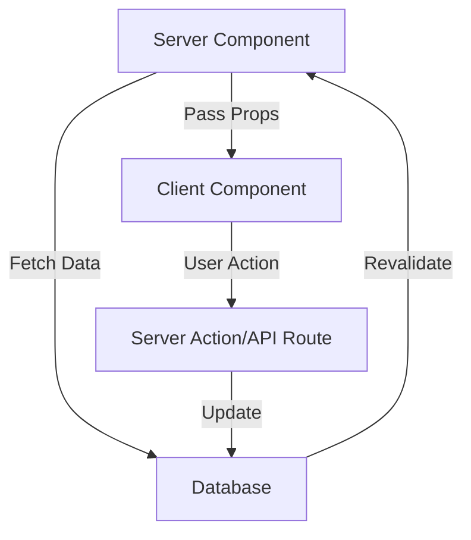

# Frontend Architecture

## Overview

The Dental Dashboard frontend is built with Next.js 15 using the App Router, React 19, and Shadcn UI components. This document describes the component hierarchy, state management patterns, routing architecture, and best practices for frontend development.

## Quick Reference

```typescript
// Component Pattern
components/
├── ui/              # Shadcn UI base components
├── dashboard/       # Dashboard-specific components
├── providers/       # Feature-specific components
└── common/          # Shared components

// State Management
- Server State: TanStack Query
- UI State: Zustand (minimal)
- Form State: React Hook Form
- Auth State: Supabase Auth
```

## Architecture Principles

### 1. Server Components First

By default, all components are Server Components unless they need interactivity.

```typescript
// Server Component (default)
// app/dashboard/page.tsx
async function DashboardPage() {
  const metrics = await fetchDashboardMetrics()
  
  return (
    <DashboardLayout>
      <MetricsGrid metrics={metrics} />
    </DashboardLayout>
  )
}

// Client Component (only when needed)
// components/dashboard/interactive-chart.tsx
'use client'

import { useState } from 'react'

export function InteractiveChart({ data }) {
  const [filter, setFilter] = useState('all')
  // Interactive logic here
}
```

### 2. Component Hierarchy

```
App
├── RootLayout
│   ├── AuthProvider
│   └── QueryProvider
│       └── ThemeProvider
│           └── Children
├── (auth) Layout
│   ├── LoginPage
│   ├── RegisterPage
│   └── ResetPasswordPage
└── (dashboard) Layout
    ├── Sidebar
    ├── TopNav
    └── Page Content
        ├── DashboardPage
        ├── ProvidersPage
        ├── GoalsPage
        └── SettingsPage
```

### 3. Data Flow



## Routing Architecture

### App Router Structure

```
app/
├── layout.tsx              # Root layout
├── page.tsx               # Landing page
├── (auth)/                # Auth route group
│   ├── layout.tsx         # Auth layout
│   ├── login/page.tsx     
│   └── register/page.tsx  
└── (dashboard)/           # Protected route group
    ├── layout.tsx         # Dashboard layout
    ├── dashboard/page.tsx 
    ├── providers/
    │   ├── page.tsx       # List view
    │   └── [id]/page.tsx  # Detail view
    └── api/               # API routes
```

### Route Protection

```typescript
// app/(dashboard)/layout.tsx
import { redirect } from 'next/navigation'
import { getServerSession } from '@/lib/auth/session'

export default async function DashboardLayout({
  children
}: {
  children: React.ReactNode
}) {
  const session = await getServerSession()
  
  if (!session) {
    redirect('/login')
  }
  
  return (
    <div className="flex h-screen">
      <Sidebar />
      <main className="flex-1 overflow-y-auto">
        <TopNav user={session.user} />
        {children}
      </main>
    </div>
  )
}
```

### Dynamic Routes

```typescript
// app/(dashboard)/providers/[id]/page.tsx
interface PageProps {
  params: { id: string }
  searchParams: { [key: string]: string | string[] | undefined }
}

export default async function ProviderDetailPage({ 
  params 
}: PageProps) {
  const provider = await getProvider(params.id)
  
  if (!provider) {
    notFound()
  }
  
  return <ProviderDetail provider={provider} />
}
```

## State Management Patterns

### Server State with TanStack Query

```typescript
// hooks/use-providers.ts
import { useQuery, useMutation, useQueryClient } from '@tanstack/react-query'

export function useProviders(clinicId: string) {
  return useQuery({
    queryKey: ['providers', clinicId],
    queryFn: () => fetchProviders(clinicId),
    staleTime: 5 * 60 * 1000, // 5 minutes
    cacheTime: 10 * 60 * 1000, // 10 minutes
  })
}

export function useCreateProvider() {
  const queryClient = useQueryClient()
  
  return useMutation({
    mutationFn: createProvider,
    onSuccess: (data) => {
      // Invalidate and refetch
      queryClient.invalidateQueries({ queryKey: ['providers'] })
      
      // Optimistically update
      queryClient.setQueryData(
        ['provider', data.id], 
        data
      )
    }
  })
}

// Usage in component
function ProvidersList() {
  const { data, isLoading, error } = useProviders(clinicId)
  const createMutation = useCreateProvider()
  
  if (isLoading) return <Skeleton />
  if (error) return <ErrorMessage />
  
  return (
    <>
      {data.map(provider => (
        <ProviderCard key={provider.id} provider={provider} />
      ))}
      <Button onClick={() => createMutation.mutate(newProvider)}>
        Add Provider
      </Button>
    </>
  )
}
```

### UI State with Zustand

```typescript
// stores/ui-store.ts
import { create } from 'zustand'
import { persist } from 'zustand/middleware'

interface UIState {
  sidebarOpen: boolean
  theme: 'light' | 'dark' | 'system'
  toggleSidebar: () => void
  setTheme: (theme: UIState['theme']) => void
}

export const useUIStore = create<UIState>()(
  persist(
    (set) => ({
      sidebarOpen: true,
      theme: 'system',
      toggleSidebar: () => set((state) => ({ 
        sidebarOpen: !state.sidebarOpen 
      })),
      setTheme: (theme) => set({ theme })
    }),
    {
      name: 'ui-preferences'
    }
  )
)
```

### Form State with React Hook Form

```typescript
// components/providers/provider-form.tsx
import { useForm } from 'react-hook-form'
import { zodResolver } from '@hookform/resolvers/zod'

const ProviderSchema = z.object({
  name: z.string().min(2, 'Name is required'),
  email: z.string().email('Invalid email'),
  licenseNumber: z.string().min(5, 'Invalid license'),
  specialty: z.string().optional()
})

export function ProviderForm({ onSubmit }: Props) {
  const form = useForm<ProviderInput>({
    resolver: zodResolver(ProviderSchema),
    defaultValues: {
      name: '',
      email: '',
      licenseNumber: ''
    }
  })
  
  return (
    <Form {...form}>
      <form onSubmit={form.handleSubmit(onSubmit)}>
        <FormField
          control={form.control}
          name="name"
          render={({ field }) => (
            <FormItem>
              <FormLabel>Name</FormLabel>
              <FormControl>
                <Input {...field} />
              </FormControl>
              <FormMessage />
            </FormItem>
          )}
        />
        {/* More fields... */}
        <Button type="submit">Save Provider</Button>
      </form>
    </Form>
  )
}
```

## Component Patterns

### Atomic Design Structure

```
components/
├── ui/                    # Atoms
│   ├── button.tsx
│   ├── input.tsx
│   └── card.tsx
├── dashboard/             # Molecules
│   ├── kpi-card.tsx
│   ├── metric-card.tsx
│   └── chart-container.tsx
├── providers/             # Organisms
│   ├── provider-card.tsx
│   ├── provider-grid.tsx
│   └── provider-filters.tsx
└── layouts/               # Templates
    ├── dashboard-layout.tsx
    └── auth-layout.tsx
```

### Component Composition

```typescript
// Composable component pattern
// components/ui/card.tsx
export function Card({ className, ...props }: CardProps) {
  return (
    <div
      className={cn("rounded-lg border bg-card", className)}
      {...props}
    />
  )
}

export function CardHeader({ className, ...props }: CardHeaderProps) {
  return (
    <div
      className={cn("flex flex-col space-y-1.5 p-6", className)}
      {...props}
    />
  )
}

// Usage
<Card>
  <CardHeader>
    <CardTitle>Monthly Production</CardTitle>
    <CardDescription>Total production this month</CardDescription>
  </CardHeader>
  <CardContent>
    <div className="text-2xl font-bold">$125,000</div>
  </CardContent>
</Card>
```

### Loading States

```typescript
// components/providers/provider-grid.tsx
import { Skeleton } from '@/components/ui/skeleton'

export function ProviderGrid({ clinicId }: Props) {
  const { data, isLoading } = useProviders(clinicId)
  
  if (isLoading) {
    return <ProviderGridSkeleton />
  }
  
  return (
    <div className="grid grid-cols-1 md:grid-cols-2 lg:grid-cols-3 gap-4">
      {data?.map(provider => (
        <ProviderCard key={provider.id} provider={provider} />
      ))}
    </div>
  )
}

function ProviderGridSkeleton() {
  return (
    <div className="grid grid-cols-1 md:grid-cols-2 lg:grid-cols-3 gap-4">
      {Array.from({ length: 6 }).map((_, i) => (
        <Card key={i}>
          <CardHeader>
            <Skeleton className="h-4 w-32" />
            <Skeleton className="h-3 w-24" />
          </CardHeader>
          <CardContent>
            <Skeleton className="h-20 w-full" />
          </CardContent>
        </Card>
      ))}
    </div>
  )
}
```

### Error Boundaries

```typescript
// components/error-boundary/error-boundary.tsx
'use client'

import { useEffect } from 'react'
import { Button } from '@/components/ui/button'

export default function ErrorBoundary({
  error,
  reset,
}: {
  error: Error & { digest?: string }
  reset: () => void
}) {
  useEffect(() => {
    // Log error to monitoring service
    console.error(error)
  }, [error])
  
  return (
    <div className="flex flex-col items-center justify-center min-h-[400px]">
      <h2 className="text-2xl font-semibold mb-4">
        Something went wrong!
      </h2>
      <p className="text-muted-foreground mb-4">
        {error.message || 'An unexpected error occurred'}
      </p>
      <Button onClick={reset}>Try again</Button>
    </div>
  )
}
```

## Data Fetching Patterns

### Server Components Data Fetching

```typescript
// app/(dashboard)/providers/page.tsx
import { Suspense } from 'react'
import { ProviderGrid } from '@/components/providers/provider-grid'
import { ProviderFilters } from '@/components/providers/provider-filters'

export default async function ProvidersPage({
  searchParams
}: {
  searchParams: { location?: string; status?: string }
}) {
  return (
    <div className="space-y-4">
      <ProviderFilters />
      <Suspense fallback={<ProviderGridSkeleton />}>
        <ProviderList filters={searchParams} />
      </Suspense>
    </div>
  )
}

async function ProviderList({ filters }: { filters: any }) {
  const providers = await fetchProviders(filters)
  return <ProviderGrid providers={providers} />
}
```

### Client-Side Data Fetching

```typescript
// hooks/use-dashboard-metrics.ts
export function useDashboardMetrics(period: DateRange) {
  const { data, isLoading, error } = useQuery({
    queryKey: ['dashboard-metrics', period],
    queryFn: () => fetchMetrics(period),
    refetchInterval: 5 * 60 * 1000, // Refresh every 5 minutes
    retry: 3,
    retryDelay: (attemptIndex) => Math.min(1000 * 2 ** attemptIndex, 30000)
  })
  
  return {
    metrics: data,
    isLoading,
    error
  }
}

// Prefetching
export function usePrefetchMetrics() {
  const queryClient = useQueryClient()
  
  return (period: DateRange) => {
    queryClient.prefetchQuery({
      queryKey: ['dashboard-metrics', period],
      queryFn: () => fetchMetrics(period)
    })
  }
}
```

### Optimistic Updates

```typescript
// hooks/use-goal-mutations.ts
export function useUpdateGoal() {
  const queryClient = useQueryClient()
  
  return useMutation({
    mutationFn: updateGoal,
    onMutate: async (newGoal) => {
      // Cancel in-flight queries
      await queryClient.cancelQueries({ 
        queryKey: ['goals', newGoal.id] 
      })
      
      // Snapshot previous value
      const previousGoal = queryClient.getQueryData(['goals', newGoal.id])
      
      // Optimistically update
      queryClient.setQueryData(['goals', newGoal.id], newGoal)
      
      return { previousGoal }
    },
    onError: (err, newGoal, context) => {
      // Rollback on error
      if (context?.previousGoal) {
        queryClient.setQueryData(
          ['goals', newGoal.id], 
          context.previousGoal
        )
      }
    },
    onSettled: (data, error, variables) => {
      // Always refetch after error or success
      queryClient.invalidateQueries({ 
        queryKey: ['goals', variables.id] 
      })
    }
  })
}
```

## Authentication Flow

### Auth Context Provider

```typescript
// contexts/auth-context.tsx
'use client'

import { createContext, useContext, useEffect, useState } from 'react'
import { User } from '@supabase/supabase-js'
import { supabase } from '@/lib/supabase/client'

interface AuthContextType {
  user: User | null
  isLoading: boolean
  signOut: () => Promise<void>
}

const AuthContext = createContext<AuthContextType>({
  user: null,
  isLoading: true,
  signOut: async () => {}
})

export function AuthProvider({ children }: { children: React.ReactNode }) {
  const [user, setUser] = useState<User | null>(null)
  const [isLoading, setIsLoading] = useState(true)
  
  useEffect(() => {
    // Get initial session
    supabase.auth.getSession().then(({ data: { session } }) => {
      setUser(session?.user ?? null)
      setIsLoading(false)
    })
    
    // Listen for auth changes
    const { data: { subscription } } = supabase.auth.onAuthStateChange(
      (_event, session) => {
        setUser(session?.user ?? null)
      }
    )
    
    return () => subscription.unsubscribe()
  }, [])
  
  const signOut = async () => {
    await supabase.auth.signOut()
  }
  
  return (
    <AuthContext.Provider value={{ user, isLoading, signOut }}>
      {children}
    </AuthContext.Provider>
  )
}

export const useAuth = () => {
  const context = useContext(AuthContext)
  if (!context) {
    throw new Error('useAuth must be used within AuthProvider')
  }
  return context
}
```

### Protected Routes

```typescript
// components/auth/auth-guard.tsx
'use client'

import { useAuth } from '@/contexts/auth-context'
import { redirect } from 'next/navigation'
import { useEffect } from 'react'

export function AuthGuard({ children }: { children: React.ReactNode }) {
  const { user, isLoading } = useAuth()
  
  useEffect(() => {
    if (!isLoading && !user) {
      redirect('/login')
    }
  }, [user, isLoading])
  
  if (isLoading) {
    return <LoadingScreen />
  }
  
  if (!user) {
    return null
  }
  
  return <>{children}</>
}
```

## Performance Optimization

### Code Splitting

```typescript
// Dynamic imports for heavy components
import dynamic from 'next/dynamic'

const HeavyChart = dynamic(
  () => import('@/components/charts/heavy-chart'),
  {
    loading: () => <ChartSkeleton />,
    ssr: false // Disable SSR for client-only components
  }
)

// Route-based code splitting (automatic with App Router)
// Each page.tsx is automatically code-split
```

### Image Optimization

```typescript
// Use Next.js Image component
import Image from 'next/image'

export function ProviderAvatar({ provider }: Props) {
  return (
    <Image
      src={provider.photoUrl || '/default-avatar.png'}
      alt={provider.name}
      width={40}
      height={40}
      className="rounded-full"
      placeholder="blur"
      blurDataURL="data:image/jpeg;base64,..."
    />
  )
}
```

### Memoization

```typescript
// components/dashboard/expensive-calculation.tsx
import { useMemo } from 'react'

export function MetricsAnalysis({ data }: Props) {
  // Expensive calculation
  const analysis = useMemo(() => {
    return calculateComplexMetrics(data)
  }, [data])
  
  // Memoized component
  const Chart = useMemo(() => (
    <ExpensiveChart data={analysis} />
  ), [analysis])
  
  return (
    <div>
      <h2>Analysis Results</h2>
      {Chart}
    </div>
  )
}

// React.memo for pure components
export const PureProviderCard = React.memo(
  ProviderCard,
  (prevProps, nextProps) => {
    return prevProps.provider.id === nextProps.provider.id
  }
)
```

### Virtual Scrolling

```typescript
// For large lists
import { useVirtualizer } from '@tanstack/react-virtual'

export function VirtualProviderList({ providers }: Props) {
  const parentRef = useRef<HTMLDivElement>(null)
  
  const virtualizer = useVirtualizer({
    count: providers.length,
    getScrollElement: () => parentRef.current,
    estimateSize: () => 100,
    overscan: 5
  })
  
  return (
    <div ref={parentRef} className="h-[600px] overflow-auto">
      <div
        style={{
          height: `${virtualizer.getTotalSize()}px`,
          position: 'relative'
        }}
      >
        {virtualizer.getVirtualItems().map((virtualItem) => (
          <div
            key={virtualItem.index}
            style={{
              position: 'absolute',
              top: 0,
              left: 0,
              width: '100%',
              height: `${virtualItem.size}px`,
              transform: `translateY(${virtualItem.start}px)`
            }}
          >
            <ProviderCard provider={providers[virtualItem.index]} />
          </div>
        ))}
      </div>
    </div>
  )
}
```

## Styling Patterns

### Tailwind CSS with CN Utility

```typescript
// lib/utils.ts
import { clsx, type ClassValue } from 'clsx'
import { twMerge } from 'tailwind-merge'

export function cn(...inputs: ClassValue[]) {
  return twMerge(clsx(inputs))
}

// Usage
<Button
  className={cn(
    "bg-primary text-primary-foreground",
    isLoading && "opacity-50 cursor-not-allowed",
    size === "lg" && "px-8 py-3"
  )}
>
  Submit
</Button>
```

### CSS Variables for Theming

```css
/* styles/globals.css */
@layer base {
  :root {
    --background: 0 0% 100%;
    --foreground: 224 71.4% 4.1%;
    --primary: 220.9 39.3% 11%;
    --primary-foreground: 210 20% 98%;
    /* More variables... */
  }
  
  .dark {
    --background: 224 71.4% 4.1%;
    --foreground: 210 20% 98%;
    --primary: 210 20% 98%;
    --primary-foreground: 220.9 39.3% 11%;
    /* Dark theme variables... */
  }
}
```

### Responsive Design

```typescript
// Responsive grid component
export function ResponsiveGrid({ children }: Props) {
  return (
    <div className={cn(
      "grid gap-4",
      "grid-cols-1",           // Mobile
      "sm:grid-cols-2",        // Tablet
      "lg:grid-cols-3",        // Desktop
      "xl:grid-cols-4"         // Wide screens
    )}>
      {children}
    </div>
  )
}

// Responsive typography
<h1 className="text-2xl sm:text-3xl lg:text-4xl font-bold">
  Dashboard
</h1>
```

## Accessibility Patterns

### Keyboard Navigation

```typescript
// components/ui/dropdown-menu.tsx
export function DropdownMenu() {
  return (
    <DropdownMenuPrimitive.Root>
      <DropdownMenuPrimitive.Trigger asChild>
        <Button
          variant="ghost"
          aria-label="Open menu"
          aria-haspopup="true"
          aria-expanded={open}
        >
          <MoreVertical className="h-4 w-4" />
        </Button>
      </DropdownMenuPrimitive.Trigger>
      {/* Menu content */}
    </DropdownMenuPrimitive.Root>
  )
}
```

### Screen Reader Support

```typescript
// Proper labeling and ARIA
<form onSubmit={handleSubmit}>
  <div className="space-y-4">
    <div>
      <Label htmlFor="email">Email</Label>
      <Input
        id="email"
        type="email"
        aria-describedby="email-error"
        aria-invalid={!!errors.email}
      />
      {errors.email && (
        <p id="email-error" className="text-sm text-destructive">
          {errors.email.message}
        </p>
      )}
    </div>
  </div>
</form>

// Skip links
<a href="#main-content" className="sr-only focus:not-sr-only">
  Skip to main content
</a>
```

### Focus Management

```typescript
// Modal focus trap
import { FocusTrap } from '@radix-ui/react-focus-trap'

export function Modal({ open, onClose, children }: Props) {
  return (
    <Dialog open={open} onOpenChange={onClose}>
      <DialogContent>
        <FocusTrap active={open}>
          <div>
            <DialogHeader>
              <DialogTitle>Modal Title</DialogTitle>
              <DialogClose />
            </DialogHeader>
            {children}
          </div>
        </FocusTrap>
      </DialogContent>
    </Dialog>
  )
}
```

## Testing Patterns

### Component Testing

```typescript
// components/providers/__tests__/provider-card.test.tsx
import { render, screen } from '@testing-library/react'
import userEvent from '@testing-library/user-event'
import { ProviderCard } from '../provider-card'

describe('ProviderCard', () => {
  const mockProvider = {
    id: '1',
    name: 'Dr. Smith',
    specialty: 'General Dentistry'
  }
  
  it('renders provider information', () => {
    render(<ProviderCard provider={mockProvider} />)
    
    expect(screen.getByText('Dr. Smith')).toBeInTheDocument()
    expect(screen.getByText('General Dentistry')).toBeInTheDocument()
  })
  
  it('calls onSelect when clicked', async () => {
    const onSelect = vi.fn()
    const user = userEvent.setup()
    
    render(
      <ProviderCard 
        provider={mockProvider} 
        onSelect={onSelect} 
      />
    )
    
    await user.click(screen.getByRole('button'))
    
    expect(onSelect).toHaveBeenCalledWith('1')
  })
})
```

### Hook Testing

```typescript
// hooks/__tests__/use-providers.test.tsx
import { renderHook, waitFor } from '@testing-library/react'
import { QueryClient, QueryClientProvider } from '@tanstack/react-query'
import { useProviders } from '../use-providers'

const createWrapper = () => {
  const queryClient = new QueryClient({
    defaultOptions: {
      queries: { retry: false }
    }
  })
  
  return ({ children }: { children: React.ReactNode }) => (
    <QueryClientProvider client={queryClient}>
      {children}
    </QueryClientProvider>
  )
}

describe('useProviders', () => {
  it('fetches providers successfully', async () => {
    const { result } = renderHook(
      () => useProviders('clinic-1'),
      { wrapper: createWrapper() }
    )
    
    expect(result.current.isLoading).toBe(true)
    
    await waitFor(() => {
      expect(result.current.isSuccess).toBe(true)
    })
    
    expect(result.current.data).toHaveLength(3)
  })
})
```

## Common Patterns

### Container/Presentational Pattern

```typescript
// containers/providers-container.tsx (Smart)
export function ProvidersContainer() {
  const { data, isLoading, error } = useProviders()
  const [filter, setFilter] = useState('')
  
  const filteredProviders = useMemo(() => {
    return data?.filter(p => 
      p.name.toLowerCase().includes(filter.toLowerCase())
    )
  }, [data, filter])
  
  if (isLoading) return <LoadingState />
  if (error) return <ErrorState error={error} />
  
  return (
    <ProvidersView
      providers={filteredProviders}
      filter={filter}
      onFilterChange={setFilter}
    />
  )
}

// components/providers-view.tsx (Dumb)
interface ProvidersViewProps {
  providers: Provider[]
  filter: string
  onFilterChange: (value: string) => void
}

export function ProvidersView({
  providers,
  filter,
  onFilterChange
}: ProvidersViewProps) {
  return (
    <div>
      <SearchInput value={filter} onChange={onFilterChange} />
      <ProviderGrid providers={providers} />
    </div>
  )
}
```

### Compound Components

```typescript
// components/ui/tabs.tsx
const TabsContext = createContext<TabsContextValue>({})

export function Tabs({ value, onValueChange, children }: TabsProps) {
  return (
    <TabsContext.Provider value={{ value, onValueChange }}>
      <div className="w-full">{children}</div>
    </TabsContext.Provider>
  )
}

export function TabsList({ children }: TabsListProps) {
  return (
    <div className="flex space-x-1 border-b">{children}</div>
  )
}

export function TabsTrigger({ value, children }: TabsTriggerProps) {
  const { value: selectedValue, onValueChange } = useContext(TabsContext)
  
  return (
    <button
      className={cn(
        "px-3 py-2",
        selectedValue === value && "border-b-2 border-primary"
      )}
      onClick={() => onValueChange?.(value)}
    >
      {children}
    </button>
  )
}

// Usage
<Tabs value={activeTab} onValueChange={setActiveTab}>
  <TabsList>
    <TabsTrigger value="overview">Overview</TabsTrigger>
    <TabsTrigger value="analytics">Analytics</TabsTrigger>
  </TabsList>
  <TabsContent value="overview">...</TabsContent>
  <TabsContent value="analytics">...</TabsContent>
</Tabs>
```

## Things to Avoid

- ❌ Using Client Components unnecessarily
- ❌ Fetching data in useEffect
- ❌ Storing server state in React state
- ❌ Prop drilling (use composition instead)
- ❌ Inline styles (use Tailwind classes)
- ❌ Direct DOM manipulation
- ❌ Forgetting error boundaries
- ❌ Missing loading states

## Related Resources

- [Component Specifications](./components.md) - Detailed component docs
- [Core Workflows](./core-workflows.md) - User interaction flows
- [UI/UX Specifications](./ui-ux-spec.md) - Design guidelines
- [Testing Strategy](./testing-strategy.md) - Frontend testing

---

**Last Updated**: December 2024
**Navigation**: [Back to Architecture Index](./index.md)