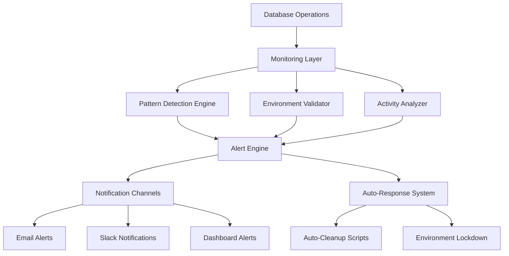

# Monitoring and Alerting System Design

## Overview
This document outlines the design for a comprehensive monitoring and alerting system to prevent database contamination and detect security issues in real-time.

## 🎯 Monitoring Objectives

1. **Prevent Test Data Contamination** - Real-time detection of test patterns in production
2. **Environment Drift Detection** - Alert when environments become inconsistent
3. **Unusual Activity Monitoring** - Detect bulk operations and suspicious patterns
4. **Database Health Monitoring** - Track performance and integrity
5. **Security Event Tracking** - Monitor for unauthorized access attempts

## System Architecture



## Monitoring Components

### 1. Real-Time Contamination Detection

#### Database Triggers for Pattern Detection
```sql
-- Trigger to detect test email patterns
CREATE OR REPLACE FUNCTION detect_test_data_insertion()
RETURNS TRIGGER AS $$
BEGIN
  -- Check for test email patterns
  IF NEW.email LIKE '%.test%' OR NEW.email LIKE '%tenant-%' THEN
    INSERT INTO monitoring_alerts (
      severity, 
      type, 
      message, 
      table_name, 
      record_id, 
      created_at
    ) VALUES (
      'CRITICAL',
      'TEST_DATA_CONTAMINATION',
      'Test email pattern detected in production: ' || NEW.email,
      TG_TABLE_NAME,
      NEW.id,
      NOW()
    );
    
    -- Optional: Prevent insertion (uncomment for strict mode)
    -- RAISE EXCEPTION 'Test data patterns not allowed in production';
  END IF;
  
  RETURN NEW;
END;
$$ LANGUAGE plpgsql;

-- Apply trigger to users table
CREATE TRIGGER users_test_data_detection
  BEFORE INSERT OR UPDATE ON users
  FOR EACH ROW
  EXECUTE FUNCTION detect_test_data_insertion();
```

#### Application-Level Monitoring
```typescript
// src/lib/monitoring/contamination-monitor.ts
export class ContaminationMonitor {
  private patterns = {
    testEmails: /\.(test|example|fake)($|@)/i,
    testNames: /(test|fake|tenant-[ab]|dummy)/i,
    testClinics: /(test clinic|fake clinic|tenant clinic)/i,
    suspiciousUUIDs: /^550e8400-e29b-41d4-a716-/
  };

  async scanOperation(operation: string, data: any) {
    const alerts = [];
    
    // Check for test patterns
    if (this.detectTestPatterns(data)) {
      alerts.push({
        severity: 'CRITICAL',
        type: 'TEST_DATA_PATTERN',
        operation,
        data: this.sanitizeData(data),
        timestamp: new Date()
      });
    }
    
    // Check for bulk operations
    if (this.detectBulkOperation(operation, data)) {
      alerts.push({
        severity: 'HIGH',
        type: 'BULK_OPERATION',
        operation,
        recordCount: Array.isArray(data) ? data.length : 1,
        timestamp: new Date()
      });
    }
    
    // Send alerts if any found
    if (alerts.length > 0) {
      await this.sendAlerts(alerts);
    }
    
    return alerts;
  }
}
```

### 2. Environment Drift Detection

#### Database Schema Monitoring
```typescript
// src/lib/monitoring/schema-monitor.ts
export class SchemaMonitor {
  async detectDrift() {
    const environments = ['production', 'staging', 'local'];
    const schemas = {};
    
    for (const env of environments) {
      schemas[env] = await this.getSchemaFingerprint(env);
    }
    
    const driftDetected = this.compareSchemasForDrift(schemas);
    
    if (driftDetected.length > 0) {
      await this.alertEnvironmentDrift(driftDetected);
    }
    
    return driftDetected;
  }
  
  private async getSchemaFingerprint(environment: string) {
    // Generate fingerprint of database schema
    // Include table structures, indexes, constraints
    return {
      tables: await this.getTableStructures(),
      indexes: await this.getIndexes(),
      constraints: await this.getConstraints(),
      checksum: await this.calculateSchemaChecksum()
    };
  }
}
```

### 3. Activity Pattern Analysis

#### Unusual Activity Detector
```typescript
// src/lib/monitoring/activity-monitor.ts
export class ActivityMonitor {
  private thresholds = {
    bulkInsertThreshold: 50,    // Records per minute
    rapidCreationThreshold: 10,  // Records per second
    offHoursThreshold: '22:00-06:00',
    suspiciousPatternThreshold: 5 // Patterns per hour
  };

  async analyzeActivity(activity: DatabaseActivity) {
    const alerts = [];
    
    // Check for bulk operations
    if (activity.recordCount > this.thresholds.bulkInsertThreshold) {
      alerts.push(this.createBulkAlert(activity));
    }
    
    // Check for rapid creation
    if (activity.ratePerSecond > this.thresholds.rapidCreationThreshold) {
      alerts.push(this.createRapidCreationAlert(activity));
    }
    
    // Check for off-hours activity
    if (this.isOffHours() && activity.operation === 'INSERT') {
      alerts.push(this.createOffHoursAlert(activity));
    }
    
    return alerts;
  }
}
```

## Alert Channels and Response

### 1. Notification Channels

#### Slack Integration
```typescript
// src/lib/notifications/slack-notifier.ts
export class SlackNotifier {
  async sendContaminationAlert(alert: ContaminationAlert) {
    const message = {
      channel: '#database-alerts',
      username: 'Database Guardian',
      icon_emoji: ':warning:',
      attachments: [{
        color: this.getSeverityColor(alert.severity),
        title: `${alert.severity}: ${alert.type}`,
        text: alert.message,
        fields: [
          { title: 'Environment', value: alert.environment, short: true },
          { title: 'Table', value: alert.tableName, short: true },
          { title: 'Time', value: alert.timestamp, short: true }
        ],
        actions: [{
          type: 'button',
          text: 'View Cleanup Script',
          url: `${process.env.APP_URL}/admin/cleanup/${alert.id}`
        }]
      }]
    };
    
    await this.sendToSlack(message);
  }
}
```

#### Email Alerts
```typescript
// src/lib/notifications/email-notifier.ts
export class EmailNotifier {
  async sendCriticalAlert(alert: Alert) {
    const template = await this.loadTemplate('critical-alert');
    
    const emailContent = template
      .replace('{{severity}}', alert.severity)
      .replace('{{message}}', alert.message)
      .replace('{{actionRequired}}', this.getActionRequired(alert))
      .replace('{{cleanupScript}}', alert.cleanupScript || 'N/A');
    
    await this.sendEmail({
      to: process.env.ADMIN_EMAIL,
      subject: `🚨 CRITICAL: ${alert.type}`,
      html: emailContent
    });
  }
}
```

### 2. Auto-Response System

#### Automatic Cleanup Trigger
```typescript
// src/lib/monitoring/auto-response.ts
export class AutoResponseSystem {
  async handleAlert(alert: Alert) {
    switch (alert.severity) {
      case 'CRITICAL':
        await this.handleCriticalAlert(alert);
        break;
      case 'HIGH':
        await this.handleHighAlert(alert);
        break;
      default:
        await this.logAlert(alert);
    }
  }
  
  private async handleCriticalAlert(alert: Alert) {
    // Immediate notifications
    await Promise.all([
      this.slackNotifier.sendContaminationAlert(alert),
      this.emailNotifier.sendCriticalAlert(alert)
    ]);
    
    // Auto-generate cleanup script
    if (alert.type === 'TEST_DATA_CONTAMINATION') {
      const cleanupScript = await this.generateCleanupScript(alert);
      alert.cleanupScript = cleanupScript;
      
      // Optional: Auto-execute for known safe patterns
      if (this.isSafeAutoCleanup(alert)) {
        await this.executeCleanup(cleanupScript);
      }
    }
    
    // Lock down environment if severe
    if (alert.severity === 'CRITICAL' && alert.affectedRecords > 100) {
      await this.lockdownEnvironment();
    }
  }
}
```

## Monitoring Dashboard

### Real-Time Status Dashboard
```typescript
// src/components/monitoring/monitoring-dashboard.tsx
export function MonitoringDashboard() {
  const { alerts, environmentStatus, activityMetrics } = useMonitoring();
  
  return (
    <div className="monitoring-dashboard">
      <EnvironmentStatusPanel status={environmentStatus} />
      <AlertsPanel alerts={alerts} />
      <ActivityMetricsPanel metrics={activityMetrics} />
      <ContaminationScanPanel />
    </div>
  );
}
```

### Historical Analysis
```typescript
// src/lib/monitoring/analytics.ts
export class MonitoringAnalytics {
  async generateContaminationReport(timeRange: TimeRange) {
    return {
      totalAlerts: await this.countAlerts(timeRange),
      severityBreakdown: await this.getAlertsBySeverity(timeRange),
      commonPatterns: await this.getCommonPatterns(timeRange),
      responseMetrics: await this.getResponseMetrics(timeRange),
      trendsAnalysis: await this.getTrends(timeRange)
    };
  }
}
```

## Implementation Phases

### Phase 1: Basic Monitoring (Week 1-2)
- [ ] Database triggers for test pattern detection
- [ ] Basic contamination scanner
- [ ] Slack notifications
- [ ] Manual cleanup script generation

### Phase 2: Advanced Detection (Week 3-4)
- [ ] Activity pattern analysis
- [ ] Environment drift detection
- [ ] Email alert system
- [ ] Monitoring dashboard

### Phase 3: Automation (Week 5-6)
- [ ] Auto-response system
- [ ] Safe auto-cleanup for known patterns
- [ ] Historical analytics
- [ ] Performance optimization

### Phase 4: Intelligence (Week 7-8)
- [ ] Machine learning pattern detection
- [ ] Predictive alerts
- [ ] Advanced analytics
- [ ] Integration with external monitoring tools

## Configuration and Setup

### Environment Variables
```bash
# Monitoring Configuration
MONITORING_ENABLED=true
SLACK_WEBHOOK_URL=https://hooks.slack.com/services/...
ADMIN_EMAIL=admin@kamdental.com
AUTO_CLEANUP_ENABLED=false
LOCKDOWN_THRESHOLD=100
```

### Database Setup
```sql
-- Create monitoring tables
CREATE TABLE monitoring_alerts (
  id UUID PRIMARY KEY DEFAULT gen_random_uuid(),
  severity TEXT NOT NULL,
  type TEXT NOT NULL,
  message TEXT NOT NULL,
  table_name TEXT,
  record_id TEXT,
  environment TEXT DEFAULT 'production',
  metadata JSONB,
  resolved_at TIMESTAMP,
  created_at TIMESTAMP DEFAULT NOW()
);

-- Create indexes for performance
CREATE INDEX idx_alerts_severity ON monitoring_alerts(severity);
CREATE INDEX idx_alerts_type ON monitoring_alerts(type);
CREATE INDEX idx_alerts_created_at ON monitoring_alerts(created_at);
```

## Testing and Validation

### Monitoring System Tests
```typescript
// tests/monitoring/contamination-detection.test.ts
describe('Contamination Detection', () => {
  it('should detect test email patterns', async () => {
    const monitor = new ContaminationMonitor();
    const testData = { email: 'user@tenant-a.test' };
    
    const alerts = await monitor.scanOperation('INSERT', testData);
    
    expect(alerts).toHaveLength(1);
    expect(alerts[0].type).toBe('TEST_DATA_PATTERN');
    expect(alerts[0].severity).toBe('CRITICAL');
  });
});
```

## Success Metrics

- **Zero Contamination Events**: No test data in production after implementation
- **Alert Response Time**: < 5 minutes for critical alerts
- **False Positive Rate**: < 5% of alerts
- **Environment Consistency**: 100% schema consistency across environments
- **Team Awareness**: 100% of team trained on monitoring procedures

## Future Enhancements

- **Machine Learning**: Pattern detection using ML algorithms
- **Predictive Analytics**: Predict potential contamination events
- **Integration**: Connect with external monitoring tools (DataDog, Sentry)
- **Mobile Alerts**: Push notifications for critical events
- **Automated Recovery**: Advanced auto-recovery procedures