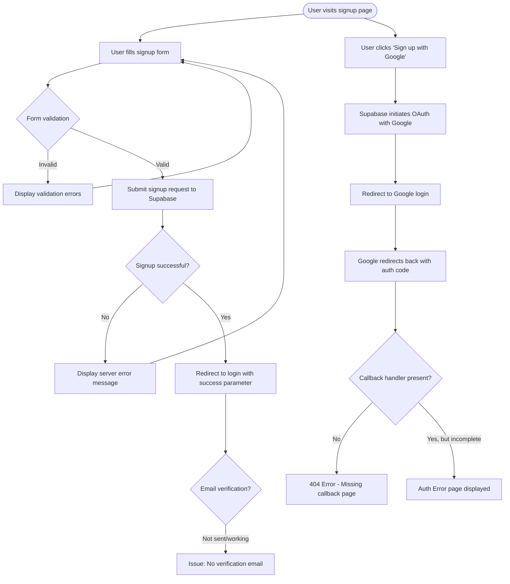

```markdown
## Analysis Current Flow
- Based on my analysis, here are the key issues with the current authentication flow:
- Missing or incomplete callback handler: The code references redirections to /auth/callback, but the callback route implementation appears to be missing or incomplete. This might cause 404 errors after OAuth authentication or email verification.
- Email verification not working: As noted in your scratchpad, users don't receive verification emails when signing up with email/password.
- Post-signup redirection: There's a redirection to the login page with a success parameter after signup, rather than directly to the dashboard, which might cause confusion for users.
- To improve your authentication flow, you should:
  - Implement the callback route handler in src/app/auth/callback/route.ts
  - Configure email verification in your Supabase project settings
  - Create a proper verification flow that handles the callback correctly
```


