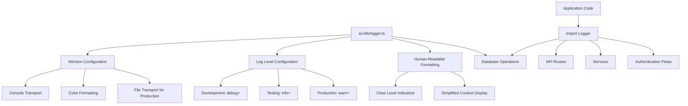

# Winston Logging Implementation Plan

Based on our discussions, I've created a comprehensive implementation plan for adding Winston logging to the dental dashboard application. This plan focuses on using a simplified set of log levels (error, warn, info, debug) with clear, color-coded formatting that's understandable for non-technical users.

## 1. Logging Architecture Overview



## 2. Centralized Logger Utility Design

### 2.1. Logger Module Structure

Create a centralized logger module at `src/lib/logger.ts` with the following components:

1. **Winston Configuration**: Set up Winston with appropriate transports based on environment
2. **Environment-based Log Level**: Configure log levels based on the environment
3. **Human-Readable Formatting**: Create a custom format that's clear and understandable
4. **Color Coding**: Use colors to distinguish between different log levels
5. **Exception Handling**: Configure handling for uncaught exceptions and unhandled promise rejections

### 2.2. Logger Module Implementation Details

```typescript
// src/lib/logger.ts
import winston from "winston";
import { format } from "winston";
import path from "path";

// Determine environment
const environment = process.env.NODE_ENV || "development";

// Set log level based on environment
const getLogLevel = () => {
  switch (environment) {
    case "production":
      return "warn";
    case "test":
      return "info";
    default:
      return "debug";
  }
};

// Define custom format for human-readable logs
const humanReadableFormat = format.printf(
  ({ level, message, timestamp, ...metadata }) => {
    // Convert metadata to a readable string, but only if it exists
    let metadataStr = "";
    if (Object.keys(metadata).length > 0) {
      // Format metadata in a more readable way
      metadataStr =
        "\nDetails: " +
        Object.entries(metadata)
          .map(([key, value]) => {
            // Handle error objects specially
            if (key === "error" && value instanceof Error) {
              return `${key}: ${value.message}`;
            }
            // Handle stack traces specially
            if (key === "stack") {
              return `stack trace: ${value}`;
            }
            // For other values, convert to string representation
            return `${key}: ${JSON.stringify(value)}`;
          })
          .join(", ");
    }

    return `${timestamp} [${level.toUpperCase()}] ${message}${metadataStr}`;
  }
);

// Create custom format with colors
const customFormat = format.combine(
  format.timestamp({ format: "YYYY-MM-DD HH:mm:ss" }),
  format.colorize({
    colors: {
      error: "red",
      warn: "yellow",
      info: "green",
      debug: "blue",
    },
  }),
  humanReadableFormat
);

// Define transports based on environment
const transports = [];

// Always add console transport
transports.push(new winston.transports.Console());

// Add file transports in production
if (environment === "production") {
  // Ensure logs directory exists
  const logsDir = path.join(process.cwd(), "logs");
  
  // Add file transport for errors
  transports.push(
    new winston.transports.File({
      filename: path.join(logsDir, "error.log"),
      level: "error",
      maxsize: 5242880, // 5MB
      maxFiles: 5,
    })
  );
  
  // Add file transport for all logs
  transports.push(
    new winston.transports.File({
      filename: path.join(logsDir, "combined.log"),
      maxsize: 5242880, // 5MB
      maxFiles: 5,
    })
  );
}

// Create Winston logger instance
// Note: We're using a custom 4-level system instead of Winston's default 7 levels
// This simplifies logging categories for our application needs
const logger = winston.createLogger({
  level: getLogLevel(),
  levels: {
    error: 0,
    warn: 1,
    info: 2,
    debug: 3,
  },
  format: customFormat,
  transports,
  // Handle uncaught exceptions
  exceptionHandlers: environment === "production" 
    ? [
        new winston.transports.File({ 
          filename: path.join(process.cwd(), "logs", "exceptions.log"),
          maxsize: 5242880, // 5MB
          maxFiles: 5,
        })
      ] 
    : [new winston.transports.Console()],
  // Prevent Winston from exiting on uncaught exceptions
  exitOnError: false,
});

// Configure unhandled promise rejection handling
if (environment === "production") {
  logger.rejections.handle(
    new winston.transports.File({ 
      filename: path.join(process.cwd(), "logs", "rejections.log"),
      maxsize: 5242880, // 5MB 
      maxFiles: 5,
    })
  );
} else {
  logger.rejections.handle(
    new winston.transports.Console()
  );
}

export default logger;
```

### 2.3. Log Message Format Examples

Here's how the log messages will appear in the console:

**Error Level (Red)**:

```
2025-05-21 13:15:42 [ERROR] Failed to connect to Google Sheets API
Details: spreadsheetId: "1A2B3C4D5E", error: "Invalid credentials", userId: "user123"
```

**Warning Level (Yellow)**:

```
2025-05-21 13:16:23 [WARN] User session expired
Details: userId: "user123", sessionAge: "3h 15m"
```

**Info Level (Green)**:

```
2025-05-21 13:17:05 [INFO] User logged in successfully
Details: userId: "user123", email: "user@example.com"
```

**Debug Level (Blue)**:

```
2025-05-21 13:18:12 [DEBUG] Fetching spreadsheet data
Details: spreadsheetId: "1A2B3C4D5E", range: "Sheet1!A1:D10"
```

## 3. Specific Logging Examples by Level and Component

### 3.1. Error Level Logs

Error logs indicate critical issues that prevent normal operation or represent significant failures. These should be used for exceptions, failed operations, and other serious issues.

**API Routes Example**:

```typescript
try {
  // API operation
} catch (error) {
  logger.error("Failed to process API request", {
    path: request.url,
    method: request.method,
    error: error.message,
    stack: error.stack,
    userId: session?.user?.id || "unauthenticated",
  });
  return NextResponse.json(
    { error: "An error occurred while processing your request" },
    { status: 500 }
  );
}
```

**Console Output**:

```
2025-05-21 13:20:45 [ERROR] Failed to process API request
Details: path: "/api/google/sheets/ABC123", method: "GET", error: "Invalid credentials", userId: "user123"
```

**Google Services Example**:

```typescript
try {
  // Google API call
} catch (error) {
  logger.error("Google Sheets API error", {
    operation: "getSpreadsheetMetadata",
    spreadsheetId,
    error: error.message,
    stack: error.stack,
  });
  throw new Error("Failed to retrieve spreadsheet data");
}
```

**Console Output**:

```
2025-05-21 13:22:18 [ERROR] Google Sheets API error
Details: operation: "getSpreadsheetMetadata", spreadsheetId: "1A2B3C4D5E", error: "The caller does not have permission"
```

**Database Operations Example**:

```typescript
try {
  // Database operation
} catch (error) {
  logger.error("Database operation failed", {
    operation: "findDataSource",
    id,
    userId,
    error: error.message,
    stack: error.stack,
  });
  throw error;
}
```

**Console Output**:

```
2025-05-21 13:24:05 [ERROR] Database operation failed
Details: operation: "findDataSource", id: "ds123", userId: "user123", error: "Connection refused"
```

### 3.2. Warning Level Logs

Warning logs indicate potential issues or unexpected situations that don't immediately halt the application but might lead to problems if not addressed.

**Authentication Example**:

```typescript
if (error) {
  logger.warn("Login attempt failed", {
    email,
    errorCode: error.code,
    errorMessage: error.message,
    attemptCount: loginAttempts,
  });
  return { success: false, error };
}
```

**Console Output**:

```
2025-05-21 13:26:30 [WARN] Login attempt failed
Details: email: "user@example.com", errorCode: "auth/invalid-credentials", errorMessage: "Invalid email or password", attemptCount: 3
```

**API Routes Example**:

```typescript
if (!dataSource || !dataSource.credentials) {
  logger.warn("Data source not found or credentials missing", {
    dataSourceId,
    userId,
    hasCredentials: !!dataSource?.credentials,
  });
  return NextResponse.json(
    { error: "Data source not found or credentials missing" },
    { status: 404 }
  );
}
```

**Console Output**:

```
2025-05-21 13:28:15 [WARN] Data source not found or credentials missing
Details: dataSourceId: "ds123", userId: "user123", hasCredentials: false
```

**Google Services Example**:

```typescript
if (tokenExpiring) {
  logger.warn("Google access token near expiration", {
    dataSourceId,
    userId,
    expiresIn: "5 minutes",
    tokenType: "access_token",
  });
  // Attempt to refresh token
}
```

**Console Output**:

```
2025-05-21 13:30:42 [WARN] Google access token near expiration
Details: dataSourceId: "ds123", userId: "user123", expiresIn: "5 minutes", tokenType: "access_token"
```

### 3.3. Info Level Logs

Info logs highlight the progress of the application and track workflows and major events.

**API Routes Example**:

```typescript
logger.info("API request received", {
  method: request.method,
  path: request.url,
  params: { spreadsheetId },
  userId: session.user.id,
});

// Process request...

logger.info("API request completed successfully", {
  method: request.method,
  path: request.url,
  responseStatus: 200,
  responseTime: `${Date.now() - startTime}ms`,
});
```

**Console Output**:

```
2025-05-21 13:32:18 [INFO] API request received
Details: method: "GET", path: "/api/google/sheets/ABC123", params: {"spreadsheetId":"ABC123"}, userId: "user123"

2025-05-21 13:32:19 [INFO] API request completed successfully
Details: method: "GET", path: "/api/google/sheets/ABC123", responseStatus: 200, responseTime: "120ms"
```

**Authentication Example**:

```typescript
logger.info("User logged in successfully", {
  userId: user.id,
  email: user.email,
  loginMethod: "password",
});
```

**Console Output**:

```
2025-05-21 13:34:05 [INFO] User logged in successfully
Details: userId: "user123", email: "user@example.com", loginMethod: "password"
```

**Google Services Example**:

```typescript
logger.info("Google Sheets data fetched", {
  spreadsheetId,
  sheetName,
  rowCount: data.values.length,
  columnCount: data.values[0].length,
});
```

**Console Output**:

```
2025-05-21 13:36:22 [INFO] Google Sheets data fetched
Details: spreadsheetId: "1A2B3C4D5E", sheetName: "Patients", rowCount: 150, columnCount: 8
```

### 3.4. Debug Level Logs

Debug logs provide detailed information useful during development and debugging.

**API Routes Example**:

```typescript
logger.debug("Processing API request parameters", {
  spreadsheetId,
  dataSourceId,
  queryParams: Object.fromEntries(searchParams.entries()),
});
```

**Console Output**:

```
2025-05-21 13:38:45 [DEBUG] Processing API request parameters
Details: spreadsheetId: "1A2B3C4D5E", dataSourceId: "ds123", queryParams: {"range":"Sheet1!A1:D10","format":"json"}
```

**Google Services Example**:

```typescript
logger.debug("Creating OAuth client", {
  hasAccessToken: !!accessToken,
  tokenLength: accessToken?.length,
});
```

**Console Output**:

```
2025-05-21 13:40:12 [DEBUG] Creating OAuth client
Details: hasAccessToken: true, tokenLength: 172
```

**Database Operations Example**:

```typescript
logger.debug("Executing database query", {
  model: "DataSource",
  operation: "findUnique",
  where: { id, userId },
  select: ["credentials"],
});
```

**Console Output**:

```
2025-05-21 13:42:30 [DEBUG] Executing database query
Details: model: "DataSource", operation: "findUnique", where: {"id":"ds123","userId":"user123"}, select: ["credentials"]
```

## 4. Integration Strategy for Different Components

### 4.1. API Routes

For API routes, we'll implement logging at these key points:

1. **Request Received**: Log when a request is received with method, path, and parameters
2. **Authentication Check**: Log the result of authentication checks
3. **Data Processing**: Log key data processing steps
4. **External Service Calls**: Log before and after calls to external services
5. **Response Sent**: Log when a response is sent with status code and timing
6. **Error Handling**: Log detailed error information in catch blocks

Example implementation for an API route:

```typescript
export async function GET(request: NextRequest, { params }) {
  const startTime = Date.now();

  // Log request received
  logger.info("API request received", {
    method: "GET",
    path: request.url,
    params,
  });

  try {
    // Authentication check
    const {
      data: { session },
      error: sessionError,
    } = await supabase.auth.getSession();

    if (sessionError || !session) {
      logger.warn("Unauthorized API access attempt", {
        method: "GET",
        path: request.url,
        error: sessionError?.message,
      });
      return NextResponse.json({ error: "Unauthorized" }, { status: 401 });
    }

    logger.debug("User authenticated", { userId: session.user.id });

    // Process request parameters
    const spreadsheetId = params.spreadsheetId;
    const { searchParams } = new URL(request.url);
    const dataSourceId = searchParams.get("dataSourceId");

    logger.debug("Request parameters processed", {
      spreadsheetId,
      dataSourceId,
      queryParams: Object.fromEntries(searchParams.entries()),
    });

    // Data validation
    if (!dataSourceId) {
      logger.warn("Missing required parameter", {
        parameter: "dataSourceId",
        userId: session.user.id,
      });
      return NextResponse.json(
        { error: "Data source ID is required" },
        { status: 400 }
      );
    }

    // Database operation
    logger.debug("Fetching data source from database", {
      dataSourceId,
      userId: session.user.id,
    });

    const dataSource = await prisma.dataSource.findUnique({
      where: { id: dataSourceId, userId: session.user.id },
      select: { credentials: true },
    });

    // External service call
    logger.info("Calling Google Sheets API", {
      operation: "getSpreadsheetMetadata",
      spreadsheetId,
      userId: session.user.id,
    });

    const metadata = await getSpreadsheetMetadata(accessToken, spreadsheetId);

    logger.info("Google Sheets API call successful", {
      spreadsheetId,
      sheetCount: metadata.sheets?.length || 0,
    });

    // Response preparation
    const response = {
      spreadsheetId: metadata.spreadsheetId,
      spreadsheetTitle: metadata.properties.title,
      sheets: sheetsInfo,
    };

    // Log successful response
    logger.info("API request completed successfully", {
      method: "GET",
      path: request.url,
      responseStatus: 200,
      responseTime: `${Date.now() - startTime}ms`,
    });

    return NextResponse.json(response);
  } catch (error) {
    // Log error with context
    logger.error("API request failed", {
      method: "GET",
      path: request.url,
      error: error.message,
      stack: error.stack,
      responseTime: `${Date.now() - startTime}ms`,
    });

    let errorMessage = "Internal server error";
    let statusCode = 500;

    // Determine specific error type for better user feedback
    if (error instanceof Error) {
      if (error.message.includes("Requested entity was not found")) {
        statusCode = 404;
        errorMessage = "Spreadsheet not found or access denied.";

        logger.warn("Resource not found", {
          spreadsheetId: params.spreadsheetId,
          errorType: "NOT_FOUND",
        });
      }
    }

    return NextResponse.json({ error: errorMessage }, { status: statusCode });
  }
}
```

### 4.2. Google Services

For Google services, we'll implement logging at these key points:

1. **Function Entry**: Log when a function is called with key parameters
2. **API Call Preparation**: Log before making API calls
3. **API Response Processing**: Log after receiving API responses
4. **Error Handling**: Log detailed error information in catch blocks

Example implementation for a Google service:

```typescript
export async function getSpreadsheetMetadata(
  accessToken: string,
  spreadsheetId: string
): Promise<SpreadsheetMetadata | null> {
  logger.debug("Getting spreadsheet metadata", {
    spreadsheetId,
    hasAccessToken: !!accessToken,
  });

  try {
    logger.debug("Creating OAuth client");
    const authClient = createOAuthClient(accessToken);

    logger.debug("Initializing Google Sheets client");
    const sheets = google.sheets({ version: "v4", auth: authClient });

    logger.info("Making Google Sheets API request", {
      operation: "spreadsheets.get",
      spreadsheetId,
      fields: "spreadsheetId,properties.title,spreadsheetUrl,sheets.properties",
    });

    const response = await sheets.spreadsheets.get({
      spreadsheetId,
      fields:
        "spreadsheetId,properties.title,spreadsheetUrl,sheets.properties(sheetId,title,index)",
    });

    logger.debug("Google Sheets API response received", {
      status: response.status,
      hasData: !!response.data,
    });

    const data = response.data;
    if (data) {
      logger.info("Spreadsheet metadata retrieved successfully", {
        spreadsheetId: data.spreadsheetId,
        title: data.properties?.title,
        sheetCount: data.sheets?.length || 0,
      });

      return {
        spreadsheetId: data.spreadsheetId!,
        spreadsheetUrl: data.spreadsheetUrl!,
        title: data.properties?.title!,
        sheets:
          data.sheets?.map((sheet) => ({
            properties: {
              sheetId: sheet.properties?.sheetId!,
              title: sheet.properties?.title!,
              index: sheet.properties?.index!,
            },
          })) || [],
      } as SpreadsheetMetadata;
    }

    logger.warn("Empty response from Google Sheets API", {
      spreadsheetId,
      operation: "spreadsheets.get",
    });

    return null;
  } catch (error) {
    logger.error("Failed to get spreadsheet metadata", {
      spreadsheetId,
      error: error instanceof Error ? error.message : "Unknown error",
      stack: error instanceof Error ? error.stack : undefined,
    });

    throw new Error("Failed to get spreadsheet metadata");
  }
}
```

### 4.3. Authentication Flows

For authentication flows, we'll implement logging at these key points:

1. **Authentication Attempt**: Log when a user attempts to authenticate
2. **Token Exchange**: Log when exchanging codes for tokens
3. **Session Creation/Validation**: Log when creating or validating sessions
4. **Authentication Success/Failure**: Log the result of authentication attempts
5. **Logout**: Log when a user logs out

Example implementation for an authentication flow:

```typescript
export async function GET(request: NextRequest) {
  const requestUrl = new URL(request.url);
  const code = requestUrl.searchParams.get("code");

  logger.info("Auth callback received", {
    hasCode: !!code,
    origin: requestUrl.origin,
  });

  if (code) {
    logger.debug("Exchanging code for session");
    const supabase = await createClient();

    try {
      // Exchange the code for a session
      logger.info("Exchanging authorization code for session");
      const { error } = await supabase.auth.exchangeCodeForSession(code);

      if (error) {
        logger.warn("Failed to exchange code for session", {
          error: error.message,
          errorCode: error.code,
        });

        return NextResponse.json({ error: error.message }, { status: 400 });
      }

      logger.info("Successfully exchanged code for session");
      return NextResponse.json({ success: true });
    } catch (error) {
      logger.error("Error during code exchange", {
        error: error instanceof Error ? error.message : "Unknown error",
        stack: error instanceof Error ? error.stack : undefined,
      });

      return NextResponse.json(
        { error: "An unexpected error occurred during authentication" },
        { status: 500 }
      );
    }
  }

  // If no code is provided, return error
  logger.warn("No authorization code provided in callback");
  return NextResponse.json({ error: "No code provided" }, { status: 400 });
}
```

### 4.4. Database Operations

For database operations, we'll implement logging at these key points:

1. **Query Preparation**: Log before executing database queries
2. **Query Results**: Log after receiving query results
3. **Error Handling**: Log detailed error information in catch blocks

Example implementation for database operations:

```typescript
async function getDataSource(id: string, userId: string) {
  logger.debug("Fetching data source", {
    id,
    userId,
    operation: "findUnique",
  });

  try {
    const dataSource = await prisma.dataSource.findUnique({
      where: { id, userId },
      select: { credentials: true },
    });

    if (!dataSource) {
      logger.info("Data source not found", {
        id,
        userId,
      });
      return null;
    }

    logger.debug("Data source retrieved successfully", {
      id,
      hasCredentials: !!dataSource.credentials,
    });

    return dataSource;
  } catch (error) {
    logger.error("Error fetching data source", {
      id,
      userId,
      error: error instanceof Error ? error.message : "Unknown error",
      stack: error instanceof Error ? error.stack : undefined,
    });

    throw error;
  }
}
```

## 5. Implementation Steps

1. **Setup and Configuration**

   - Install Winston package: `pnpm add winston`
   - Create the logger module in `src/lib/logger.ts`
   - Configure log levels and formatting
   - Set up appropriate transports based on environment
   - Configure exception and rejection handling

2. **Core Infrastructure Updates**

   - Update database connection to include logging
   - Add logging to middleware for request/response tracking
   - Ensure logs directory exists and is writable in production

3. **API Routes Updates**

   - Systematically update API routes to use the logger
   - Ensure consistent logging patterns across all routes

4. **Services Updates**

   - Update Google services to use structured logging
   - Add appropriate log levels for different operations

5. **Authentication Updates**

   - Add logging to authentication flows
   - Ensure sensitive information is not logged

6. **Testing and Validation**
   - Verify logs are generated correctly in different environments
   - Ensure log levels are appropriate for each environment
   - Check that structured logging is used consistently
   - Test exception handling by triggering deliberate errors

## 6. Best Practices to Follow

1. **Use Human-Readable Messages**: Write log messages that are clear and understandable to non-technical users
2. **Use Structured Context**: Always pass an object as the second argument to logger methods
3. **Include Relevant Context**: Add contextual information that helps understand the log
4. **Use Appropriate Log Levels**: Follow the guidelines for when to use each log level
5. **Avoid Sensitive Information**: Never log passwords, tokens, or PII
6. **Be Consistent**: Use the same logging patterns throughout the codebase
7. **Log Entry and Exit Points**: Log at the beginning and end of important functions
8. **Log Business Logic Decisions**: Log when the application makes significant choices

## 7. Production Considerations

### 7.1. Log Rotation and Management

For production environments, ensure log files are properly managed to prevent disk space issues:

- Configure maximum file sizes and number of files to keep
- Consider implementing log rotation using Winston's built-in features or external tools
- Regularly archive or clean up old log files

### 7.2. Distributed Logging Options

For a more scalable production setup, consider these distributed logging options:

1. **ELK Stack Integration**:
   - Forward logs to Elasticsearch using winston-elasticsearch transport
   - Visualize and analyze logs with Kibana dashboards
   - Use Logstash for advanced log processing

2. **Cloud Logging Services**:
   - AWS CloudWatch: `winston-cloudwatch` transport
   - Google Cloud Logging: `@google-cloud/logging-winston` transport
   - Azure Monitor: `winston-azure-application-insights` transport

3. **Centralized Logging Services**:
   - Papertrail: `winston-papertrail` transport
   - Loggly: `winston-loggly-bulk` transport
   - Datadog: `datadog-winston` transport

Example configuration for Google Cloud Logging:

```typescript
// Add this to src/lib/logger.ts
if (environment === "production") {
  const { LoggingWinston } = require("@google-cloud/logging-winston");
  const loggingWinston = new LoggingWinston({
    projectId: "your-project-id",
    // Keyfile is automatically detected in production environments
  });
  
  logger.add(loggingWinston);
}
```

### 7.3. Performance Considerations

To minimize the performance impact of logging in production:

- Use asynchronous logging (Winston's default)
- Consider batching logs for external services
- Implement appropriate log levels to reduce volume
- Use sampling for high-volume debug logs
