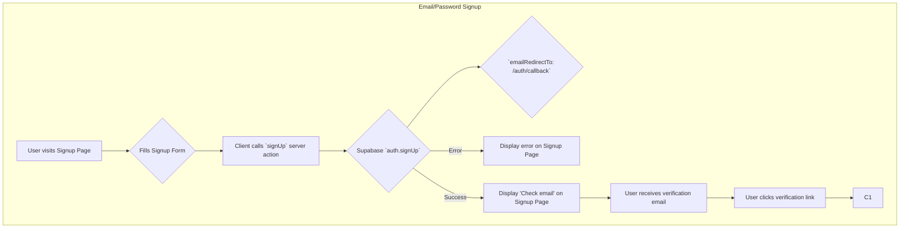
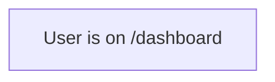

    subgraph OAuth (e.g., Google) Signup/Login
        B1[User visits Signup/Login Page] --> B2[User clicks 'Sign in with Google']
        B2 --> B3[Client calls `signInWithOAuth` server action]
        B3 --> B4{Supabase `auth.signInWithOAuth`}
        B4 --> B5{`redirectTo: /auth/callback`}
        B4 -- Error --> B6[Display error on Signup/Login Page]
        B4 -- Success --> B7[Redirect to Google Auth Screen]
        B7 --> B8[User authenticates with Google]
        B8 --> B9[Google redirects to /auth/callback]
        B9 --> C1
    end
```
    subgraph Email/Password Login
        L1[User visits Login Page] --> L2{Fills Login Form}
        L2 --> L3[Client calls `login` server action]
        L3 --> L4{Supabase `auth.signInWithPassword`}
        L4 -- Error --> L5[Display error on Login Page]
        L4 -- Success --> D1[Redirect to /dashboard]
    end
```
    subgraph Password Reset
        P1[User visits Reset Password Page] --> P2{Enters Email}
        P2 --> P3[Client calls `resetPassword` server action]
        P3 --> P4{Supabase `auth.resetPasswordForEmail`}
        P4 --> P5{`redirectTo: /auth/reset-password/confirm`}
        P4 -- Error --> P6[Display error on Reset Password Page]
        P4 -- Success --> P7[Display 'Check email' on Reset Password Page]
        P7 --> P8[User receives reset email]
        P8 --> P9[User clicks reset link]
        P9 --> P10[Navigate to /auth/reset-password/confirm Page]
        P10 --> P11{User enters new password}
        P11 --> P12[Client calls `updatePassword` server action]
        P12 --> P13{Supabase `auth.updateUser`}
        P13 -- Error --> P14[Display error on Confirm Page]
        P13 -- Success --> P15[Display 'Password updated', suggest login]
        P15 --> L1
    end
```
    subgraph Callback Handling
        C1[User lands on /auth/callback Page] --> C2{`code` in URL?}
        C2 -- No Code --> C3[Redirect to /auth/login]
        C2 -- Yes --> C4[Client `createBrowserClient`]
        C4 --> C5{Supabase `auth.exchangeCodeForSession(code)`}
        C5 -- Error --> C6[Redirect to /auth/auth-error Page]
        C5 -- Success --> D1
    end
```


```markdown∏
## Analysis Current Flow
- Based on my analysis, here are the key issues with the current authentication flow:
- Missing or incomplete callback handler: The code references redirections to /auth/callback, but the callback route implementation appears to be missing or incomplete. This might cause 404 errors after OAuth authentication or email verification.
- Email verification not working: As noted in your scratchpad, users don't receive verification emails when signing up with email/password.
- Post-signup redirection: There's a redirection to the login page with a success parameter after signup, rather than directly to the dashboard, which might cause confusion for users.
- To improve your authentication flow, you should:
  - Implement the callback route handler in src/app/auth/callback/route.ts
  - Configure email verification in your Supabase project settings
  - Create a proper verification flow that handles the callback correctly
```


