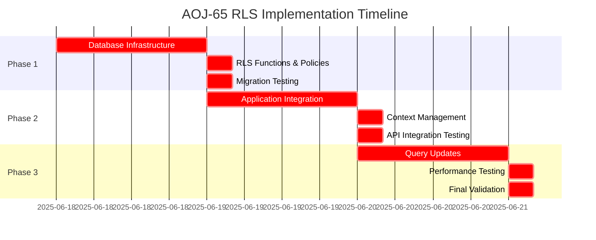

# AOJ-65: Implement PostgreSQL Row-Level Security (RLS) for Multi-tenant Data Isolation

## Document Information

| Field | Value |
|-------|-------|
| **Issue ID** | AOJ-65 |
| **Priority** | 🔴 **URGENT** (Level 1) |
| **Complexity** | **HIGH RISK** |
| **Due Date** | 3 Days (Fast-shipping for critical security) |
| **Type** | Critical Security Enhancement |
| **Labels** | `security`, `technical-debt`, `database`, `multi-tenant`, `hipaa-compliance` |
| **Assignee** | AOJ Sr |
| **Created** | 2025-06-17 |
| **Linear URL** | [AOJ-65](https://linear.app/aojdevstudio/issue/AOJ-65) |

---

## Executive Summary

**CRITICAL SECURITY VULNERABILITY**: The current multi-tenant architecture relies solely on application-layer tenant isolation through manual `clinicId` injection in Prisma queries. This approach creates a **single point of failure** that could lead to **Protected Health Information (PHI) data leakage** and **HIPAA compliance violations**.

**Solution**: Implement PostgreSQL Row-Level Security (RLS) policies to enforce database-level multi-tenant data isolation, eliminating the risk of human error exposing sensitive healthcare data.

**AI Guardrails Strategy**: Due to the critical nature and high-risk scope (affecting core database security, multiple tables, and application layers), this implementation requires a **strict phased approach** with maximum 1-2 files modified per session and comprehensive validation at each checkpoint.

---

## Background and Strategic Fit

### Current Vulnerability

**Application-Layer Only (UNSAFE)**:
```typescript
// ❌ Current pattern - single point of failure
const providers = await prisma.provider.findMany({
  where: { clinicId }, // ← If forgotten, exposes ALL clinic data
  // ... rest of query
});
```

**Identified Risks**:
- **PHI Data Leakage**: Single missing `where: { clinicId }` exposes all tenant data
- **HIPAA Violation**: Insufficient data isolation for healthcare applications
- **Manual Error Prone**: Relies on developer memory for security-critical operations
- **Audit Failure**: No database-level enforcement audit trail

### Required Solution

**Database-Layer Enforcement (SECURE)**:
```sql
-- ✅ Automatic isolation at database level
ALTER TABLE public.providers ENABLE ROW LEVEL SECURITY;

CREATE POLICY "clinic_isolation" ON public.providers 
FOR ALL USING (clinic_id = auth.get_current_clinic_id());
```

### Strategic Alignment
- **Compliance**: HIPAA-compliant multi-tenant architecture
- **Security**: Defense-in-depth security model
- **Risk Reduction**: Eliminate human error from tenant isolation
- **Audit Ready**: Database-level enforcement with built-in audit trails

---

## Goals and Success Metrics

### Primary Goals
1. **Eliminate PHI Data Leakage Risk**: 100% database-level tenant isolation
2. **HIPAA Compliance**: Meet healthcare data protection requirements
3. **Zero Trust Architecture**: Remove reliance on application-layer enforcement
4. **Performance Maintenance**: No significant query performance degradation (<10% impact)

### Success Metrics
- **Security**: RLS policies block cross-tenant data access (100% isolation)
- **Functionality**: All existing features work without modification
- **Performance**: Query execution time increase <10% average
- **Compliance**: Pass security audit for multi-tenant isolation
- **Developer Experience**: Simplified query patterns (no manual `clinicId` injection)

---

## Detailed Requirements

### 🔴 HIGH RISK FILES (Core System Changes)

| File Category | Files Affected | Risk Level | Changes Required |
|---------------|----------------|------------|------------------|
| **Database Schema** | `migrations/rls-implementation.sql` | **HIGH** | RLS policies, database functions |
| **Database Client** | `src/lib/database/client.ts` | **HIGH** | Clinic context management |
| **Auth Middleware** | `src/lib/auth/middleware.ts` | **HIGH** | Session clinic context injection |
| **API Middleware** | `src/lib/api/middleware.ts` | **MEDIUM** | Request context setup |

### 🟡 MEDIUM RISK FILES (Application Integration)

| File Category | Files Affected | Risk Level | Changes Required |
|---------------|----------------|------------|------------------|
| **Database Queries** | `src/lib/database/queries/*.ts` | **MEDIUM** | Remove manual `clinicId` filters |
| **API Routes** | `src/app/api/**/route.ts` | **MEDIUM** | Context setup integration |
| **Service Layer** | `src/lib/services/**/*.ts` | **MEDIUM** | Query pattern updates |

### 🟢 LOW RISK FILES (Testing & Validation)

| File Category | Files Affected | Risk Level | Changes Required |
|---------------|----------------|------------|------------------|
| **Test Files** | `src/**/*.test.ts` | **LOW** | RLS testing utilities |
| **Migration Tests** | `prisma/migrations/test/*.sql` | **LOW** | Policy validation scripts |

---

## AI Guardrails Implementation Strategy

### 🚨 CRITICAL: AI Guardrails Required

This issue meets **MULTIPLE** automatic guardrails triggers:
- ✅ More than 5 files need modification
- ✅ Core application files are affected (database, APIs, components)
- ✅ Security fixes affecting multiple layers
- ✅ Changes that could break existing functionality
- ✅ Database schema changes affecting all data access

### File-Level Constraints

1. **Maximum 1-2 files per implementation session**
2. **Start with lowest risk** (test files, utilities)
3. **End with highest risk** (core database, authentication)
4. **Maximum 15-20 lines of changes per AI session**
5. **Mandatory compilation check after each file**

### Implementation Sequence (STRICT ORDER)

#### Phase 1: Database Infrastructure (Day 1)
```
Session 1: Create migration file structure
Session 2: Database context functions only
Session 3: Enable RLS on 1-2 tables maximum
Session 4: Create policies for enabled tables
Session 5: Test migration rollback
```

#### Phase 2: Application Integration (Day 2)
```
Session 1: Update database client for context management
Session 2: Modify auth middleware for clinic context
Session 3: Update 1-2 API routes maximum
Session 4: Test context injection functionality
Session 5: Validate tenant isolation
```

#### Phase 3: Query Updates & Validation (Day 3)
```
Session 1: Update 1-2 query files maximum
Session 2: Remove manual clinicId filters gradually
Session 3: Comprehensive testing suite
Session 4: Performance impact assessment
Session 5: Final validation and documentation
```

### Safety Prompts for Each Session

```
MANDATORY prompts for AI implementation:
1. "Analyze impact on dependent files before making changes"
2. "Show only minimal, targeted changes for RLS implementation"
3. "Identify files that import from this modified module"
4. "Preserve existing API contracts and interfaces"
5. "Limit changes to maximum 15 lines per response"
6. "Test compilation after this specific change"
```

### Incremental Validation Checkpoints

- ✅ **After each file**: TypeScript compilation successful
- ✅ **After each session**: Relevant tests pass
- ✅ **After each phase**: Integration tests successful
- ✅ **Daily**: Full test suite execution
- ✅ **Final**: Security penetration testing

---

## Implementation Plan

### Phase 1: Database Infrastructure Setup (Day 1)

**Duration**: 8 hours  
**Risk Level**: HIGH  
**Validation**: Migration success, rollback tested

#### Tasks:
1. **Database Context Functions**
   - Create `auth.get_current_clinic_id()` function
   - Create `auth.set_clinic_context()` function
   - Test function execution and security definer access

2. **RLS Policy Infrastructure**
   - Enable RLS on core tables (`providers`, `dentist_production`, `hygiene_production`)
   - Create basic isolation policies
   - Test policy enforcement with sample data

3. **Migration Safety**
   - Create rollback migration scripts
   - Test migration/rollback cycle
   - Validate existing data integrity

#### Deliverables:
- [ ] `migrations/rls-phase1-infrastructure.sql`
- [ ] `migrations/rollback/rls-phase1-rollback.sql`
- [ ] Database function test scripts
- [ ] Policy enforcement validation

### Phase 2: Application Integration (Day 2)

**Duration**: 8 hours  
**Risk Level**: HIGH  
**Validation**: Context injection functional, tenant isolation working

#### Tasks:
1. **Database Client Updates**
   - Modify Prisma client initialization
   - Add clinic context management
   - Test connection with context setting

2. **Authentication Integration**
   - Update auth middleware for clinic context injection
   - Integrate with session management
   - Test user authentication flow

3. **API Integration**
   - Update API middleware for request context
   - Test API routes with RLS enforcement
   - Validate proper tenant isolation

#### Deliverables:
- [ ] Updated `src/lib/database/client.ts`
- [ ] Updated `src/lib/auth/middleware.ts`
- [ ] Updated `src/lib/api/middleware.ts`
- [ ] Context injection test suite

### Phase 3: Query Updates & Final Validation (Day 3)

**Duration**: 8 hours  
**Risk Level**: MEDIUM  
**Validation**: Full application functionality, performance benchmarks

#### Tasks:
1. **Query Pattern Updates**
   - Remove manual `clinicId` filters from queries
   - Test automatic RLS enforcement
   - Validate query result correctness

2. **Performance Optimization**
   - Benchmark query performance impact
   - Optimize RLS policies if needed
   - Validate <10% performance degradation

3. **Comprehensive Testing**
   - Security penetration testing
   - Multi-tenant isolation validation
   - Full application feature testing

#### Deliverables:
- [ ] Updated query files with RLS patterns
- [ ] Performance benchmark report
- [ ] Security audit validation
- [ ] Complete RLS documentation

---

## Technical Considerations

### Database Schema Changes

```sql
-- Core RLS Functions
CREATE OR REPLACE FUNCTION auth.get_current_clinic_id()
RETURNS UUID AS $$
BEGIN
  RETURN COALESCE(
    current_setting('app.current_clinic_id', true)::uuid,
    NULL
  );
END;
$$ LANGUAGE plpgsql SECURITY DEFINER;

-- Session Management
CREATE OR REPLACE FUNCTION auth.set_clinic_context(clinic_id UUID)
RETURNS void AS $$
BEGIN
  PERFORM set_config('app.current_clinic_id', clinic_id::text, true);
END;
$$ LANGUAGE plpgsql SECURITY DEFINER;
```

### Application Integration Pattern

```typescript
// Database client with RLS context
export async function withClinicContext<T>(
  clinicId: string,
  operation: () => Promise<T>
): Promise<T> {
  await prisma.$executeRaw`SELECT auth.set_clinic_context(${clinicId}::uuid)`;
  try {
    return await operation();
  } finally {
    await prisma.$executeRaw`SELECT auth.set_clinic_context(NULL)`;
  }
}
```

### Performance Considerations

- **Index Optimization**: Ensure `clinic_id` columns are properly indexed
- **Policy Efficiency**: Use efficient RLS policy conditions
- **Connection Pooling**: Context setting impact on connection reuse
- **Query Planning**: Monitor execution plan changes

### Security Considerations

- **Function Security**: Use `SECURITY DEFINER` for context functions
- **Policy Completeness**: Cover all CRUD operations (SELECT, INSERT, UPDATE, DELETE)
- **Bypass Prevention**: Ensure no superuser bypass in application layer
- **Audit Logging**: Enable RLS policy execution logging

---

## Risks and Mitigation

### 🔴 HIGH RISK

| Risk | Impact | Mitigation |
|------|--------|------------|
| **Data Access Disruption** | Application breaks, users locked out | Phased rollout, immediate rollback capability |
| **Performance Degradation** | Slow application response | Performance testing, query optimization |
| **Incomplete Policy Coverage** | Data leakage continues | Comprehensive policy testing, security audit |
| **Context Injection Failure** | RLS blocks legitimate access | Robust error handling, fallback mechanisms |

### 🟡 MEDIUM RISK

| Risk | Impact | Mitigation |
|------|--------|------------|
| **Migration Complexity** | Deployment issues | Thorough migration testing, rollback scripts |
| **Developer Learning Curve** | Slower development | Documentation, training, code examples |
| **Debugging Complexity** | Harder to troubleshoot | Enhanced logging, debugging tools |

### 🟢 LOW RISK

| Risk | Impact | Mitigation |
|------|--------|------------|
| **Documentation Gaps** | Maintenance difficulty | Comprehensive documentation update |
| **Test Coverage** | Bugs in production | Expanded test suite for RLS scenarios |

---

## Timeline and Milestones

### Critical Path Timeline (3 Days)



### Milestone Checkpoints

#### Day 1 Milestones
- [ ] ✅ RLS infrastructure deployed to staging
- [ ] ✅ Database functions functional
- [ ] ✅ Basic policies enforcing isolation
- [ ] ✅ Migration rollback tested

#### Day 2 Milestones
- [ ] ✅ Application context injection working
- [ ] ✅ Authentication flow with RLS functional
- [ ] ✅ API routes respecting tenant isolation
- [ ] ✅ Integration tests passing

#### Day 3 Milestones
- [ ] ✅ All queries updated for RLS
- [ ] ✅ Performance benchmarks within limits
- [ ] ✅ Security audit passed
- [ ] ✅ Production deployment ready

---

## Acceptance Criteria

### Functional Requirements

#### ✅ Database Level
- [ ] **RLS Enabled**: All multi-tenant tables have RLS enabled
- [ ] **Policies Active**: Isolation policies block cross-tenant access
- [ ] **Functions Working**: Context management functions operational
- [ ] **Migration Safe**: Rollback capability tested and functional

#### ✅ Application Level
- [ ] **Context Injection**: Clinic context automatically set for all requests
- [ ] **Authentication Flow**: User authentication includes clinic context setting
- [ ] **API Isolation**: All API endpoints respect tenant boundaries
- [ ] **Query Simplification**: Manual `clinicId` filters removed from queries

#### ✅ Security Requirements
- [ ] **Zero Cross-Tenant Access**: Security testing confirms complete isolation
- [ ] **No Data Leakage**: Comprehensive testing shows no PHI exposure
- [ ] **Audit Trail**: RLS policy execution logged for compliance
- [ ] **Penetration Testing**: External security validation passed

#### ✅ Performance Requirements
- [ ] **<10% Degradation**: Query performance impact within acceptable limits
- [ ] **Index Optimization**: All RLS-related queries use appropriate indexes
- [ ] **Connection Efficiency**: Context setting doesn't impact connection pooling
- [ ] **Monitoring**: Performance metrics collected and baselined

#### ✅ Development Experience
- [ ] **Simplified Queries**: Developers no longer manually add `clinicId` filters
- [ ] **Clear Documentation**: RLS patterns and usage documented
- [ ] **Error Handling**: Clear error messages for RLS-related issues
- [ ] **Testing Tools**: Utilities for testing multi-tenant scenarios

### Non-Functional Requirements

#### ✅ Reliability
- [ ] **Zero Downtime**: Deployment doesn't disrupt service
- [ ] **Rollback Ready**: Immediate rollback capability in case of issues
- [ ] **Error Recovery**: Graceful handling of RLS-related errors

#### ✅ Maintainability
- [ ] **Code Quality**: All changes follow project coding standards
- [ ] **Documentation**: Complete RLS implementation guide
- [ ] **Test Coverage**: All RLS scenarios covered by automated tests

#### ✅ Compliance
- [ ] **HIPAA Ready**: Multi-tenant isolation meets healthcare requirements
- [ ] **Audit Compliance**: RLS enforcement auditable and logged
- [ ] **Policy Management**: Easy to add/modify RLS policies for new tables

---

## Success Definition

**AOJ-65 is considered COMPLETE when**:

1. **🔒 Security**: Complete database-level multi-tenant isolation implemented
2. **🚀 Functionality**: All application features work without manual tenant filtering
3. **⚡ Performance**: Query performance impact <10% average
4. **✅ Testing**: Security audit confirms zero cross-tenant data access
5. **📚 Documentation**: Complete RLS implementation guide available
6. **🔄 Deployment**: Production deployment successful with rollback capability

**Critical Success Indicator**: A security penetration test attempting to access cross-tenant data returns zero unauthorized records across all multi-tenant tables.

---

*This PRD was generated using AI Guardrails Strategy for safe, incremental implementation of critical security infrastructure. All phases must be completed in strict sequence with validation checkpoints.* 