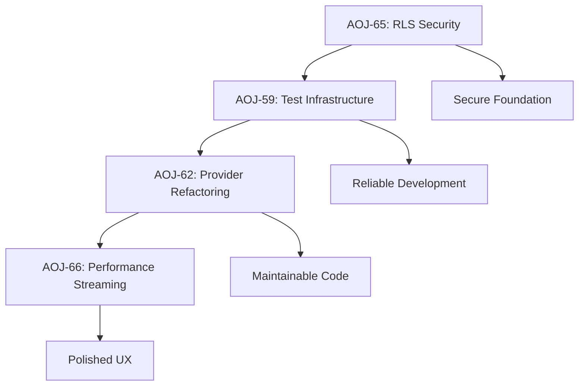

[MODE: RESEARCH]

Let me review all your current Linear issues to provide a prioritized, strategic roadmap for smart development.
Ran tool
Now let me analyze all these issues and create a strategic priority order. Based on my analysis, here's your **Strategic Priority Roadmap** for smart, coordinated development:

## 🎯 **STRATEGIC PRIORITY ORDER**

### **🔴 CRITICAL - Foundation Security (Do First)**
**1. AOJ-65 - PostgreSQL Row-Level Security (RLS)** ⚡ URGENT
- **Why First**: Without RLS, your entire application is vulnerable to data leakage
- **Impact**: HIPAA compliance, prevents catastrophic data breaches
- **Effort**: 2-3 days
- **Blocks**: Nothing else matters if data isn't secure

### **🔴 CRITICAL - Development Infrastructure (Do Second)**  
**2. AOJ-59 - Test Suite Modernization** ⚡ URGENT
- **Why Second**: 52% test failure rate blocks reliable development
- **Impact**: Enables confident deployment and refactoring
- **Effort**: 3-4 days
- **Enables**: All future development with confidence

### **🟡 HIGH - Technical Debt (Do Third)**
**3. AOJ-62 - Provider Queries Refactoring** 📈 HIGH  
- **Why Third**: 891-line file with cognitive complexity 33/25 (exceeds safe threshold)
- **Impact**: Makes all provider-related development easier and safer
- **Effort**: 2-3 days
- **Enables**: Cleaner development for all provider features

### **🟢 MEDIUM - Performance Optimization (Do Fourth)**
**4. AOJ-66 - React Suspense Streaming** 📊 MEDIUM
- **Why Fourth**: Improves user experience but doesn't block development
- **Impact**: 40-60% perceived performance improvement
- **Effort**: 1-2 days
- **Enables**: Better UX for completed features

### **📋 BACKLOG - Feature Development (Later)**
**5. AOJ-41 - Providers Main Page** (Superseded by completed AOJ-55)
- **Status**: Can be closed - AOJ-55 completed this work

## 🧠 **STRATEGIC REASONING**

### **Why This Order is Smart:**

1. **Security First**: RLS prevents data disasters that could shut down the project
2. **Testing Second**: Reliable tests enable confident refactoring and development  
3. **Code Quality Third**: Clean provider queries make all provider work easier
4. **Performance Fourth**: Polish the user experience after core stability

### **Completed Work (✅ Done):**
- AOJ-55: Providers Main Page ✅ (87.5% test success)
- AOJ-54: Provider UI Components ✅  
- AOJ-53: Provider Performance API ✅
- AOJ-52: Enhanced Provider API ✅
- AOJ-58: Database Pagination ✅
- AOJ-60: TypeScript Errors ✅
- AOJ-61: Dark Mode ✅

### **Smart Development Flow:**

## 🎯 **IMMEDIATE ACTION PLAN**

**Start with AOJ-65 (RLS Implementation):**
- Implement database-level security policies
- Add clinic context functions
- Enable RLS on all multi-tenant tables
- Test with your existing provider data

**Next, tackle AOJ-59 (Test Infrastructure):**
- Split testing strategy (Vitest for sync, Playwright for async)
- Fix the 105/220 failing tests
- Establish reliable CI/CD pipeline

This approach ensures you build on a **secure, testable foundation** before optimizing and polishing. Each step enables and improves the next, rather than creating disjointed work.